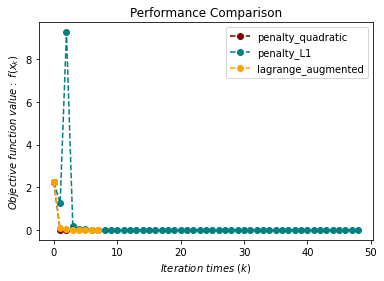

# 最优化计算方法工具包（optimtool）

&emsp;&emsp;&emsp;[](https://pypi.org/project/optimtool/)

Github项目地址：https://github.com/linjing-lab/optimtool

CSDN个人博客主页：https://blog.csdn.net/linjing_zyq

如何下载： `pip install optimtool`

## 1. 项目介绍

&emsp;&emsp;该工具包采用了北京大学出版的《最优化：建模、算法与理论》这本书中的部分理论方法框架，运用了`Numpy`包高效处理数组间运算等的特性，巧妙地应用了`Sympy`内部支持的`.jacobian`等方法，设计了一个用于最优化科学研究领域的Python工具包。 研究人员可以通过简单的`pip`指令进行下载与使用。

&emsp;&emsp;因为在求解不同的目标函数的全局或局部收敛点时，不同的求取收敛点的方法会有不同的收敛效率以及不同的适用范围，而且在研究过程中不同领域的研究方法被不断地提出、修改、完善、扩充，所以这些方法成了现在人们口中的`最优化方法`。 此项目中的所有内部支持的算法，都是在范数、导数、凸集、凸函数、共轭函数、次梯度和最优化理论等基础方法论的基础上进行设计与完善的。

        目前这个工具包内置了诸如Barzilar Borwein非单调梯度下降法、修正牛顿法、有限内存BFGS方法、截断共轭梯度法-信赖域方法、高斯-牛顿法等无约束优化领域收敛效率与性质较好的算法，以及用于解决约束优化问题的二次罚函数法、增广拉格朗日法等算法。

&emsp;&emsp;这个工具包内无约束优化与约束优化板块的算法仍然需要不断更新、维护与扩充，并且应用于混合约束优化板块的算法将在日后上线。 我们非常欢迎广大热爱数学、编程的各界人士加入开发与更新最优化计算方法的队伍中，提出新的框架或算法，成为里程碑中的一员。

## 2. 项目结构

```textile
|- optimtool
    |-- constrain
        |-- __init__.py
        |-- equal.py
        |-- mixequal.py
        |-- unequal.py
    |-- example
        |-- __init__.py
        |-- Lasso.py
        |-- WanYuan.py
    |-- functions
        |-- __init__.py
        |-- linear_search.py
        |-- tools.py
    |-- hybrid
        |-- __init__.py
    |-- unconstrain
        |-- __init__.py
        |-- gradient_descent.py
        |-- newton.py
        |-- newton_quasi.py
        |-- nonlinear_least_square.py
        |-- trust_region.py  
    |-- __init__.py 
```

## 3. 开始使用

### 3.1 无约束优化算法（unconstrain）

```python
import optimtool.unconstrain as ou
ou.[方法名].[函数名]([目标函数], [参数表], [初始迭代点])
```

#### 3.1.1 梯度下降法（gradient_descent）

```python
ou.gradient_descent.[函数名]([目标函数], [参数表], [初始迭代点])
```

| 方法头                                                                                                                                 | 解释                                   |
| ----------------------------------------------------------------------------------------------------------------------------------- | ------------------------------------ |
| solve(funcs, args, x_0, draw=True, output_f=False, epsilon=1e-10, k=0)                                                              | 通过解方程的方式来求解精确步长                      |
| steepest(funcs, args, x_0, draw=True, output_f=False, method="wolfe", epsilon=1e-10, k=0)                                           | 使用线搜索方法求解非精确步长（默认使用wolfe线搜索）         |
| barzilar_borwein(funcs, args, x_0, draw=True, output_f=False, method="grippo", M=20, c1=0.6, beta=0.6, alpha=1, epsilon=1e-10, k=0) | 使用Grippo与Zhang hanger提出的非单调线搜索方法更新步长 |

#### 3.1.2 牛顿法（newton)

```python
ou.newton.[函数名]([目标函数], [参数表], [初始迭代点])
```

| 方法头                                                                                             | 解释                                |
| ----------------------------------------------------------------------------------------------- | --------------------------------- |
| classic(funcs, args, x_0, draw=True, output_f=False, epsilon=1e-10, k=0)                        | 通过直接对目标函数二阶导矩阵（海瑟矩阵）进行求逆来获取下一步的步长 |
| modified(funcs, args, x_0, draw=True, output_f=False, method="wolfe", m=20, epsilon=1e-10, k=0) | 修正当前海瑟矩阵保证其正定性（目前只接入了一种修正方法）      |
| CG(funcs, args, x_0, draw=True, output_f=False, method="wolfe", epsilon=1e-6, k=0)              | 采用牛顿-共轭梯度法求解梯度（非精确牛顿法的一种）         |

#### 3.1.3 拟牛顿法（newton_quasi）

```python
ou.newton_quasi.[函数名]([目标函数], [参数表], [初始迭代点])
```

| 方法头                                                                                          | 解释              |
| -------------------------------------------------------------------------------------------- | --------------- |
| bfgs(funcs, args, x_0, draw=True, output_f=False, method="wolfe", m=20, epsilon=1e-10, k=0)  | BFGS方法更新海瑟矩阵    |
| dfp(funcs, args, x_0, draw=True, output_f=False, method="wolfe", m=20, epsilon=1e-4, k=0)    | DFP方法更新海瑟矩阵     |
| L_BFGS(funcs, args, x_0, draw=True, output_f=False, method="wolfe", m=6, epsilon=1e-10, k=0) | 双循环方法更新BFGS海瑟矩阵 |

#### 3.1.4 非线性最小二乘法（nonlinear_least_square）

```python
ou.nonlinear_least_square.[函数名]([目标函数], [参数表], [初始迭代点])
```

| 方法头                                                                                                                                                  | 解释                         |
| ---------------------------------------------------------------------------------------------------------------------------------------------------- | -------------------------- |
| gauss_newton(funcr, args, x_0, draw=True, output_f=False, method="wolfe", epsilon=1e-10, k=0)                                                        | 高斯-牛顿提出的方法框架，包括OR分解等操作     |
| levenberg_marquardt(funcr, args, x_0, draw=True, output_f=False, m=100, lamk=1, eta=0.2, p1=0.4, p2=0.9, gamma1=0.7, gamma2=1.3, epsilon=1e-10, k=0) | Levenberg Marquardt提出的方法框架 |

#### 3.1.5 信赖域方法（trust_region）

```python
ou.trust_region.[函数名]([目标函数], [参数表], [初始迭代点])
```

| 方法头                                                                                                                                               | 解释                |
| ------------------------------------------------------------------------------------------------------------------------------------------------- | ----------------- |
| steihaug_CG(funcs, args, x_0, draw=True, output_f=False, m=100, r0=1, rmax=2, eta=0.2, p1=0.4, p2=0.6, gamma1=0.5, gamma2=1.5, epsilon=1e-6, k=0) | 截断共轭梯度法在此方法中被用于搜索步长 |

### 3.2 约束优化算法（constrain）

```python
import optimtool.constrain as oc
oc.[方法名].[函数名]([目标函数], [参数表], [等式约束表], [不等式约数表], [初始迭代点])
```

#### 3.2.1 等式约束（equal）

```python
oc.equal.[函数名]([目标函数], [参数表], [等式约束表], [初始迭代点])
```

| 方法头                                                                                                                                                   | 解释        |
| ----------------------------------------------------------------------------------------------------------------------------------------------------- | --------- |
| penalty_quadratic(funcs, args, cons, x_0, draw=True, output_f=False, method="gradient_descent", sigma=10, p=2, epsilon=1e-4, k=0)                     | 增加二次罚项    |
| lagrange_augmented(funcs, args, cons, x_0, draw=True, output_f=False, method="gradient_descent", lamk=6, sigma=10, p=2, etak=1e-4, epsilon=1e-6, k=0) | 增广拉格朗日乘子法 |

#### 3.2.2 不等式约束（unequal）

```python
oc.unequal.[函数名]([目标函数], [参数表], [不等式约数表], [初始迭代点])
```

| 方法头                                                                                                                                                                      | 解释        |
| ------------------------------------------------------------------------------------------------------------------------------------------------------------------------ | --------- |
| penalty_quadratic(funcs, args, cons, x_0, draw=True, output_f=False, method="gradient_descent", sigma=10, p=0.4, epsilon=1e-10, k=0)                                     | 增加二次罚项    |
| penalty_interior_fraction(funcs, args, cons, x_0, draw=True, output_f=False, method="gradient_descent", sigma=12, p=0.6, epsilon=1e-6, k=0)                              | 增加分式函数罚项  |
| lagrange_augmented(funcs, args, cons, x_0, draw=True, output_f=False, method="gradient_descent", muk=10, sigma=8, alpha=0.2, beta=0.7, p=2, eta=1e-1, epsilon=1e-4, k=0) | 增广拉格朗日乘子法 |

#### 3.2.3 混合等式约束（mixequal）

```python
oc.mixequal.[函数名]([目标函数], [参数表], [等式约束表], [不等式约数表], [初始迭代点])
```

| 方法头                                                                                                                                                                                                  | 解释        |
| ---------------------------------------------------------------------------------------------------------------------------------------------------------------------------------------------------- | --------- |
| penalty_quadratic(funcs, args, cons_equal, cons_unequal, x_0, draw=True, output_f=False, method="gradient_descent", sigma=10, p=0.6, epsilon=1e-10, k=0)                                             | 增加二次罚项    |
| penalty_L1(funcs, args, cons_equal, cons_unequal, x_0, draw=True, output_f=False, method="gradient_descent", sigma=1, p=0.6, epsilon=1e-10, k=0)                                                     | L1精确罚函数法  |
| lagrange_augmented(funcs, args, cons_equal, cons_unequal, x_0, draw=True, output_f=False, method="gradient_descent", lamk=6, muk=10, sigma=8, alpha=0.5, beta=0.7, p=2, eta=1e-3, epsilon=1e-4, k=0) | 增广拉格朗日乘子法 |

### 3.3 混合优化算法（hybrid）

这部分的算法将会在日后上线，欢迎各界人士前来补充。

### 3.4 方法的应用（example）

```python
import optimtool.example as oe
```

#### 3.4.1 Lasso问题（Lasso）

```python
oe.Lasso.[函数名]([矩阵A], [矩阵b], [因子mu], [参数表], [初始迭代点])
```

| 方法头                                                                                                     | 解释               |
| ------------------------------------------------------------------------------------------------------- | ---------------- |
| gradient_descent(A, b, mu, args, x_0, draw=True, output_f=False, delta=10, alp=1e-3, epsilon=1e-2, k=0) | 光滑化Lasso函数法      |
| subgradient(A, b, mu, args, x_0, draw=True, output_f=False, alphak=2e-2, epsilon=1e-3, k=0)             | 次梯度法Lasso避免一阶不可导 |

#### 3.4.2 曲线相切问题（WanYuan）

```python
oe.WanYuan.[函数名]([直线的斜率], [直线的截距], [二次项系数], [一次项系数], [常数项], [圆心横坐标], [圆心纵坐标], [初始迭代点])
```

问题描述：

```tetxile
给定直线的斜率和截距，给定一个抛物线函数的二次项系数，一次项系数与常数项。 要求解一个给定圆心的圆，该圆同时与抛物线、直线相切，若存在可行方案，请给出切点的坐标。
```

| 方法头                                                             | 解释                   |
| --------------------------------------------------------------- | -------------------- |
| gauss_newton(m, n, a, b, c, x3, y3, x_0, draw=False, eps=1e-10) | 使用高斯-牛顿方法求解构造的7个残差函数 |

## 4. 测试

### 4.1 无约束优化问题测试程序

```python
import sympy as sp
import matplotlib.pyplot as plt
import optimtool as oo

f, x1, x2, x3, x4 = sp.symbols("f x1 x2 x3 x4")
f = (x1 - 1)**2 + (x2 - 1)**2 + (x3 - 1)**2 + (x1**2 + x2**2 + x3**2 + x4**2 - 0.25)**2
funcs = sp.Matrix([f])
args = sp.Matrix([x1, x2, x3, x4])
x_0 = (1, 2, 3, 4)

f_list = []
title = ["gradient_descent_barzilar_borwein", "newton_CG", "newton_quasi_L_BFGS", "trust_region_steihaug_CG"]
colorlist = ["maroon", "teal", "slateblue", "orange"]
_, _, f = oo.unconstrain.gradient_descent.barzilar_borwein(funcs, args, x_0, False, True)
f_list.append(f)
_, _, f = oo.unconstrain.newton.CG(funcs, args, x_0, False, True)
f_list.append(f)
_, _, f = oo.unconstrain.newton_quasi.L_BFGS(funcs, args, x_0, False, True)
f_list.append(f)
_, _, f = oo.unconstrain.trust_region.steihaug_CG(funcs, args, x_0, False, True)
f_list.append(f)

# draw
handle = []
for j, z in zip(colorlist, f_list):
    ln, = plt.plot([i for i in range(len(z))], z, c=j, marker='o', linestyle='dashed')
    handle.append(ln)
plt.xlabel("$Iteration \ times \ (k)$")
plt.ylabel("$Objective \ function \ value: \ f(x_k)$")
plt.legend(handle, title)
plt.title("Performance Comparison")
plt.show()
```
<div align="center">
    
</div>

### 4.2 非线性最小二乘问题测试程序

```python
import sympy as sp
import matplotlib.pyplot as plt
import optimtool as oo

r1, r2, x1, x2 = sp.symbols("r1 r2 x1 x2")
r1 = x1**3 - 2*x2**2 - 1
r2 = 2*x1 + x2 - 2
funcr = sp.Matrix([r1, r2])
args = sp.Matrix([x1, x2])
x_0 = (2, 2)

f_list = []
title = ["gauss_newton", "levenberg_marquardt"]
colorlist = ["maroon", "teal"]
_, _, f = oo.unconstrain.nonlinear_least_square.gauss_newton(funcr, args, x_0, False, True)
f_list.append(f)
_, _, f = oo.unconstrain.nonlinear_least_square.levenberg_marquardt(funcr, args, x_0, False, True)
f_list.append(f)

# draw
handle = []
for j, z in zip(colorlist, f_list):
    ln, = plt.plot([i for i in range(len(z))], z, c=j, marker='o', linestyle='dashed')
    handle.append(ln)
plt.xlabel("$Iteration \ times \ (k)$")
plt.ylabel("$Objective \ function \ value: \ f(x_k)$")
plt.legend(handle, title)
plt.title("Performance Comparison")
plt.show()
```

<div align="center">
    
</div>

### 4.3 等式约束优化问题测试程序

```python
import numpy as np
import sympy as sp
import matplotlib.pyplot as plt
import optimtool as oo

f, x1, x2 = sp.symbols("f x1 x2")
f = x1 + np.sqrt(3) * x2
c1 = x1**2 + x2**2 - 1
funcs = sp.Matrix([f])
cons = sp.Matrix([c1])
args = sp.Matrix([x1, x2])
x_0 = (-1, -1)

f_list = []
title = ["penalty_quadratic", "lagrange_augmented"]
colorlist = ["maroon", "teal"]
_, _, f = oo.constrain.equal.penalty_quadratic(funcs, args, cons, x_0, False, True)
f_list.append(f)
_, _, f = oo.constrain.equal.lagrange_augmented(funcs, args, cons, x_0, False, True)
f_list.append(f)

# draw
handle = []
for j, z in zip(colorlist, f_list):
    ln, = plt.plot([i for i in range(len(z))], z, c=j, marker='o', linestyle='dashed')
    handle.append(ln)
plt.xlabel("$Iteration \ times \ (k)$")
plt.ylabel("$Objective \ function \ value: \ f(x_k)$")
plt.legend(handle, title)
plt.title("Performance Comparison")
plt.show()
```

<div align="center">
    
</div>

### 4.4 不等式约束优化问题测试程序

```python
import sympy as sp
import matplotlib.pyplot as plt
import optimtool as oo

f, x1, x2 = sp.symbols("f x1 x2")
f = x1**2 + (x2 - 2)**2
c1 = 1 - x1
c2 = 2 - x2
funcs = sp.Matrix([f])
cons = sp.Matrix([c1, c2])
args = sp.Matrix([x1, x2])
x_0 = (2, 3)

f_list = []
title = ["penalty_quadratic", "penalty_interior_fraction"]
colorlist = ["maroon", "teal"]
_, _, f = oo.constrain.unequal.penalty_quadratic(funcs, args, cons, x_0, False, True, method="newton", sigma=10, epsilon=1e-6)
f_list.append(f)
_, _, f = oo.constrain.unequal.penalty_interior_fraction(funcs, args, cons, x_0, False, True, method="newton")
f_list.append(f)

# draw
handle = []
for j, z in zip(colorlist, f_list):
    ln, = plt.plot([i for i in range(len(z))], z, c=j, marker='o', linestyle='dashed')
    handle.append(ln)
plt.xlabel("$Iteration \ times \ (k)$")
plt.ylabel("$Objective \ function \ value: \ f(x_k)$")
plt.legend(handle, title)
plt.title("Performance Comparison")
plt.show()
```

<div align="center">
    
</div>

`Single test Lagrange method`：

```python
import sympy as sp

# import optimtool
import optimtool as oo

# make functions
f1 = sp.symbols("f1")
x1, x2, x3, x4 = sp.symbols("x1 x2 x3 x4")
f1 = x1**2 + x2**2 + 2*x3**3 + x4**2 - 5*x1 - 5*x2 - 21*x3 + 7*x4
c1 = 8 - x1 + x2 - x3 + x4 - x1**2 - x2**2 - x3**2 - x4**2
c2 = 10 + x1 + x4 - x1**2 - 2*x2**2 - x3**2 - 2*x4**2
c3 = 5 - 2*x1 + x2 + x4 - 2*x1**2 - x2**2 - x3**2
cons_unequal1 = sp.Matrix([c1, c2, c3])
funcs1 = sp.Matrix([f1])
args1 = sp.Matrix([x1, x2, x3, x4])
x_1 = (0, 0, 0, 0)

x_0, _, f = oo.constrain.unequal.lagrange_augmented(funcs1, args1, cons_unequal1, x_1, output_f=True, method="trust_region", sigma=1, muk=1, p=1.2)
for i in range(len(x_0)):
     x_0[i] = round(x_0[i], 2)
print("\nfinal point：", x_0, "\nTarget function value：", f[-1])
```

<div align="center">
    
</div>

`result`：

```python
最终收敛点： [ 2.5   2.5   1.87 -3.5 ] 
最终目标函数值： -50.94151192711454
```

### 4.5 混合等式约束优化问题测试程序

```python
import sympy as sp
import matplotlib.pyplot as plt
import optimtool as oo

f, x1, x2 = sp.symbols("f x1 x2")
f = (x1 - 2)**2 + (x2 - 1)**2
c1 = x1 - 2*x2
c2 = 0.25*x1**2 - x2**2 - 1
funcs = sp.Matrix([f])
cons_equal = sp.Matrix([c1])
cons_unequal = sp.Matrix([c2])
args = sp.Matrix([x1, x2])
x_0 = (0.5, 1)

f_list = []
title = ["penalty_quadratic", "penalty_L1", "lagrange_augmented"]
colorlist = ["maroon", "teal", "orange"]
_, _, f = oo.constrain.mixequal.penalty_quadratic(funcs, args, cons_equal, cons_unequal, x_0, False, True)
f_list.append(f)
_, _, f = oo.constrain.mixequal.penalty_L1(funcs, args, cons_equal, cons_unequal, x_0, False, True)
f_list.append(f)
_, _, f = oo.constrain.mixequal.lagrange_augmented(funcs, args, cons_equal, cons_unequal, x_0, False, True)
f_list.append(f)

# draw
handle = []
for j, z in zip(colorlist, f_list):
    ln, = plt.plot([i for i in range(len(z))], z, c=j, marker='o', linestyle='dashed')
    handle.append(ln)
plt.xlabel("$Iteration \ times \ (k)$")
plt.ylabel("$Objective \ function \ value: \ f(x_k)$")
plt.legend(handle, title)
plt.title("Performance Comparison")
plt.show()
```

<div align="center">
    
</div>

### 4.6 Lasso问题测试程序

```python
import numpy as np
import sympy as sp
import matplotlib.pyplot as plt
import optimtool as oo

import scipy.sparse as ss
f, A, b, mu = sp.symbols("f A b mu")
x = sp.symbols('x1:9')
m = 4
n = 8
u = (ss.rand(n, 1, 0.1)).toarray()
A = np.random.randn(m, n)
b = A.dot(u)
mu = 1e-2
args = sp.Matrix(x)
x_0 = tuple([1 for i in range(8)])

f_list = []
title = ["gradient_descent", "subgradient"]
colorlist = ["maroon", "teal"]
_, _, f = oo.example.Lasso.gradient_descent(A, b, mu, args, x_0, False, True, epsilon=1e-4)
f_list.append(f)
_, _, f = oo.example.Lasso.subgradient(A, b, mu, args, x_0, False, True)
f_list.append(f)

# draw
handle = []
for j, z in zip(colorlist, f_list):
    ln, = plt.plot([i for i in range(len(z))], z, c=j, marker='o', linestyle='dashed')
    handle.append(ln)
plt.xlabel("$Iteration \ times \ (k)$")
plt.ylabel("$Objective \ function \ value: \ f(x_k)$")
plt.legend(handle, title)
plt.title("Performance Comparison")
plt.show()
```

<div align="center">
    
</div>

### 4.7 曲线切点问题测试程序

```python
# import packages
import sympy as sp
import matplotlib.pyplot as plt
import optimtool as oo

# make data
m = 1
n = 2
a = 0.2
b = -1.4
c = 2.2
x3 = 2*(1/2)
y3 = 0
x_0 = (0, -1, -2.5, -0.5, 2.5, -0.05)

# train
oo.example.WanYuan.gauss_newton(1, 2, 0.2, -1.4, 2.2, 2**(1/2), 0, (0, -1, -2.5, -0.5, 2.5, -0.05), draw=True)
```

<div align="center">
    
</div>