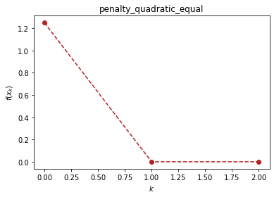
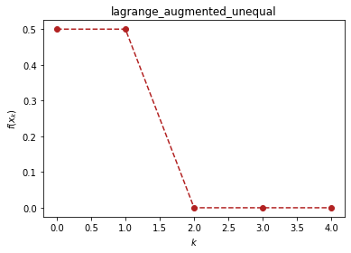
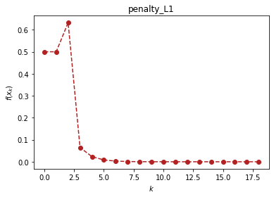

```python
import optimtool as oo
from optimtool.base import np, sp, plt
```

# 约束优化算法（optimtool.constrain）

```python
import optimtool.constrain as oc
oc.[方法名].[函数名]([目标函数], [参数表], [等式约束表], [不等式约数表], [初始迭代点])
```


```python
import optimtool.constrain as oc
f, x1, x2 = sp.symbols("f x1 x2")
f = (x1 - 2)**2 + (x2 - 1)**2
c1 = x1 - x2 - 1
c2 = 0.25*x1**2 - x2 - 1 # c2 ≤ 0 
```

## 等式约束（equal）

```python
oc.equal.[函数名]([目标函数], [参数表], [等式约束表], [初始迭代点])
```

| 方法头                                                                                                                                                                                                                                                                                  | 解释               |
| --------------------------------------------------------------------------------------------------------------------------------------------------------------------------------------------------------------------------------------------------------------------------------------- | ------------------ |
| penalty_quadratice(funcs: FuncArray, args: FuncArray, cons: FuncArray, x_0: PointArray, verbose: bool=False, draw: bool=True, output_f: bool=False, method: str="newton", sigma: float=10., p: float=2., epsk: float=1e-4, epsilon: float=1e-6, k: int=0) -> OutputType                 | 增加二次罚项       |
| lagrange_augmentede(funcs: FuncArray, args: ArgArray, cons: FuncArray, x_0: PointArray, verbose: bool=False, draw: bool=True, output_f: bool=False, method: str="newton", lamk: float=6., sigma: float=10., p: float=2., etak: float=1e-4, epsilon: float=1e-6, k: int=0) -> OutputType | 增广拉格朗日乘子法 |


```python
oc.equal.penalty_quadratice(f, (x1, x2), c1, (1, 0.5), verbose=True)
```

```text
(1, 0.5)	1.25	0
[2. 1.]	4.930380657631324e-32	1
(1.9999999999999998, 1.0)	4.930380657631324e-32	2
```

<p align="center">
    <a href=""> 
         
    </a>
</p>

```text
((1.9999999999999998, 1.0), 2)
```

## 不等式约束（unequal）

```python
oc.unequal.[函数名]([目标函数], [参数表], [不等式约束表], [初始迭代点])
```

| 方法头                                                                                                                                                                                                                                                                                                                   | 解释               |
| ------------------------------------------------------------------------------------------------------------------------------------------------------------------------------------------------------------------------------------------------------------------------------------------------------------------------ | ------------------ |
| penalty_quadraticu(funcs: FuncArray, args: ArgArray, cons: FuncArray, x_0: PointArray, verbose: bool=False, draw: bool=True, output_f: bool=False, method: str="newton", sigma: float=10., p: float=0.4, epsk: float=1e-4, epsilon: float=1e-6, k: int=0) -> OutputType                                                  | 增加二次罚项       |
| lagrange_augmentedu(funcs: FuncArray, args: ArgArray, cons: FuncArray, x_0: PointArray, verbose: bool=False, draw: bool=True, output_f: bool=False, method: str="newton", muk: float=10., sigma: float=8., alpha: float=0.2, beta: float=0.7, p: float=2., eta: float=1e-1, epsilon: float=1e-4, k: int=0) -> OutputType | 增广拉格朗日乘子法 |


```python
oc.unequal.lagrange_augmentedu(f, (x1, x2), c2, (1.5, 0.5), verbose=True)
```

```text
(1.5, 0.5)	0.5	0
(1.5, 0.5)	0.5	1
[2. 1.]	0.0	2
(2.0, 1.0)	0.0	3
(2.0, 1.0)	0.0	4
```

<p align="center">
    <a href=""> 
         
    </a>
</p>

```text
((2.0, 1.0), 4)
```

## 混合等式约束（mixequal）

```python
oc.mixequal.[函数名]([目标函数], [参数表], [等式约束表], [不等式约束表], [初始迭代点])
```

| 方法头                                                                                                                                                                                                                                                                                                                                                                   | 解释               |
| ------------------------------------------------------------------------------------------------------------------------------------------------------------------------------------------------------------------------------------------------------------------------------------------------------------------------------------------------------------------------ | ------------------ |
| penalty_quadraticm(funcs: FuncArray, args: ArgArray, cons_equal: FuncArray, cons_unequal: FuncArray, x_0: PointArray, verbose: bool=False, draw: bool=True, output_f: bool=False, method: str="newton", sigma: float=10., p: float=0.6, epsk: float=1e-6, epsilon: float=1e-10, k: int=0) -> OutputType                                                                  | 增加二次罚项       |
| penalty_L1(funcs: FuncArray, args: ArgArray, cons_equal: FuncArray, cons_unequal: FuncArray, x_0: PointArray, verbose: bool=False, draw: bool=True, output_f: bool=False, method: str="newton", sigma: float=1., p: float=0.6, epsk: float=1e-6, epsilon: float=1e-10, k: int=0) -> OutputType                                                                           | L1精确罚函数法     |
| lagrange_augmentedm(funcs: FuncArray, args: ArgArray, cons_equal: FuncArray, cons_unequal: FuncArray, x_0: PointArray, verbose: bool=False, draw: bool=True, output_f: bool=False, method: str="newton", lamk: float=6., muk: float=10., sigma: float=8., alpha: float=0.5, beta: float=0.7, p: float=2., etak: float=1e-3, epsilon: float=1e-4, k: int=0) -> OutputType | 增广拉格朗日乘子法 |


```python
oc.mixequal.penalty_L1(f, (x1, x2), c1, c2, (1.5, 0.5), verbose=True)
```

```text
(1.5, 0.5)	0.5	0
[2.5 0.5]	0.5	1
[1.47826087 1.6       ]	0.6322117202268434	2
[2.18 0.82]	0.06480000000000004	3
[1.892 1.108]	0.023328000000000043	4
[2.0648 0.9352]	0.008398079999999992	5
[1.96112 1.03888]	0.003023308800000004	6
[2.023328 0.976672]	0.001088391167999991	7
[1.9860032 1.0139968]	0.00039182082047999555	8
[2.00839808 0.99160192]	0.000141055495372801	9
[1.99496115 1.00503885]	5.0779978334209926e-05	10
[2.00302331 0.99697669]	1.8280792200315036e-05	11
[1.99818601 1.00181399]	6.581085192114058e-06	12
[2.00108839 0.99891161]	2.369190669160674e-06	13
[1.99934697 1.00065303]	8.529086408979587e-07	14
[2.00039182 0.99960818]	3.0704711072324775e-07	15
[1.99976491 1.00023509]	1.105369598604005e-07	16
[2.00014106 0.99985894]	3.9793305549762975e-08	17
(2.000141055495373, 0.9998589445046272)	3.9793305549762975e-08	18
```

<p align="center">
    <a href=""> 
         
    </a>
</p>

```text
((2.000141055495373, 0.9998589445046272), 18)
```