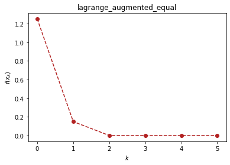
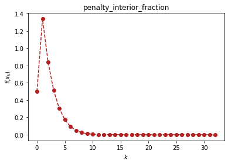

```python
# load important dependencies
import numpy as np
import sympy as sp
import matplotlib.pyplot as plt
```

# 约束优化算法（optimtool.constrain）

```python
import optimtool.constrain as oc
oc.[方法名].[函数名]([目标函数], [参数表], [等式约束表], [不等式约数表], [初始迭代点])
```


```python
import optimtool.constrain as oc
f, x1, x2 = sp.symbols("f x1 x2")
f = (x1 - 2)**2 + (x2 - 1)**2
c1 = x1 - x2 - 1
c2 = 0.25*x1**2 - x2 - 1
```

## 等式约束（equal）

```python
oc.equal.[函数名]([目标函数], [参数表], [等式约束表], [初始迭代点])
```

| 方法头                                                                                                                                                   | 解释        |
| ----------------------------------------------------------------------------------------------------------------------------------------------------- | --------- |
| penalty_quadratice(funcs: FuncArray, args: FuncArray, cons: FuncArray, x_0: PointArray, draw: bool=True, output_f: bool=False, method: str="newton", sigma: float=10, p: float=2, epsk: float=1e-4, epsilon: float=1e-4, k: int=0) -> OutputType                     | 增加二次罚项    |
| lagrange_augmentede(funcs: FuncArray, args: ArgArray, cons: FuncArray, x_0: PointArray, draw: bool=True, output_f: bool=False, method: str="newton", lamk: float=6, sigma: float=10, p: float=2, etak: float=1e-4, epsilon: float=1e-6, k: int=0) -> OutputType | 增广拉格朗日乘子法 |


```python
oc.equal.lagrange_augmentede(f, (x1, x2), c1, (1, 0.5))
```


<p align="center">
    <a href=""> 
         
    </a>
</p>


    (array([1.99999998, 1.00000002]), 5)


## 不等式约束（unequal）

```python
oc.unequal.[函数名]([目标函数], [参数表], [不等式约束表], [初始迭代点])
```

| 方法头                                                                                                                                                                      | 解释        |
| ------------------------------------------------------------------------------------------------------------------------------------------------------------------------ | --------- |
| penalty_quadraticu(funcs: FuncArray, args: ArgArray, cons: FuncArray, x_0: PointArray, draw: bool=True, output_f: bool=False, method: str="newton", sigma: float=10, p: float=0.4, epsk: float=1e-6, epsilon: float=1e-10, k: int=0) -> OutputType                                     | 增加二次罚项    |
| penalty_interior_fraction(funcs: FuncArray, args: ArgArray, cons: FuncArray, x_0: PointArray, draw: bool=True, output_f: bool=False, method: str="newton", sigma: float=12, p: float=0.6, epsk: float=1e-6, epsilon: float=1e-6, k: int=0) -> OutputType                              | 增加分式函数罚项  |
| lagrange_augmentedu(funcs: FuncArray, args: ArgArray, cons: FuncArray, x_0: PointArray, draw: bool=True, output_f: bool=False, method: str="newton", muk: float=10, sigma: float=8, alpha: float=0.2, beta: float=0.7, p: float=2, eta: float=1e-1, epsilon: float=1e-4, k: int=0) -> OutputType | 增广拉格朗日乘子法 |


```python
oc.unequal.penalty_interior_fraction(f, (x1, x2), c2, (1.5, 0.5))
```


<p align="center">
    <a href=""> 
         
    </a>
</p>


    (array([1.9999992, 1.0000008]), 32)


## 混合等式约束（mixequal）

```python
oc.mixequal.[函数名]([目标函数], [参数表], [等式约束表], [不等式约束表], [初始迭代点])
```

| 方法头                                                                                                                                                                                                  | 解释        |
| ---------------------------------------------------------------------------------------------------------------------------------------------------------------------------------------------------- | --------- |
| penalty_quadraticm(funcs: FuncArray, args: ArgArray, cons_equal: FuncArray, cons_unequal: FuncArray, x_0: PointArray, draw: bool=True, output_f: bool=False, method: str="newton", sigma: float=10, p: float=0.6, epsk: float=1e-4, epsilon: float=1e-10, k: int=0) -> OutputType                                             | 增加二次罚项    |
| penalty_L1(funcs: FuncArray, args: ArgArray, cons_equal: FuncArray, cons_unequal: FuncArray, x_0: PointArray, draw: bool=True, output_f: bool=False, method: str="newton", sigma: float=1, p: float=0.6, epsk: float=1e-6, epsilon: float=1e-10, k: int=0) -> OutputType                                                     | L1精确罚函数法  |
| lagrange_augmentedm(funcs: FuncArray, args: ArgArray, cons_equal: FuncArray, cons_unequal: FuncArray, x_0: PointArray, draw: bool=True, output_f: bool=False, method: str="newton", lamk: float=6, muk: float=10, sigma: float=8, alpha: float=0.5, beta: float=0.7, p: float=2, eta: float=1e-3, epsilon: float=1e-4, k: int=0) -> OutputType | 增广拉格朗日乘子法 |


```python
oc.mixequal.penalty_L1(f, (x1, x2), c1, c2, (1.5, 0.5))
```


<p align="center">
    <a href=""> 
         
    </a>
</p>


    (array([2., 1.]), 47)

