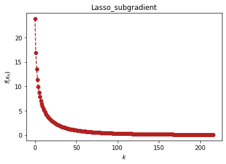

```python
import optimtool as oo
from optimtool.base import np, sp, plt
```
# 方法的应用（optimtool.example）

```python
import optimtool.example as oe
```

## Lasso问题（Lasso）

```python
oe.Lasso.[函数名]([矩阵A], [矩阵b], [因子mu], [参数表], [初始迭代点])
```

$$
\min \frac{1}{2} ||Ax-b||^2+\mu ||x||_1
$$

给定$A_{m \times n}$，$x_{n \times 1}$，$b_{m \times 1}$，正则化常数$\mu$。解决该无约束最优化问题，该问题目标函数一阶不可导。

| 方法头                                                                                                     | 解释               |
| ------------------------------------------------------------------------------------------------------- | ---------------- |
| gradient(A: NDArray, b: NDArray, mu: float, args: ArgArray, x_0: PointArray, verbose: bool=False, draw: bool=True, output_f: bool=False, delta: float=10., alp: float=1e-3, epsilon: float=1e-2, k: int=0) -> OutputType | 光滑化Lasso函数法      |
| subgradient(A: NDArray, b: NDArray, mu: float, args: ArgArray, x_0: PointArray, verbose: bool=False, draw: bool=True, output_f: bool=False, alphak: float=2e-2, epsilon: float=1e-3, k: int=0) -> OutputType             | 次梯度法Lasso避免一阶不可导 |
| approximate_point(A: NDArray, b: NDArray, mu: float, args: ArgArray, x_0: PointArray, verbose: bool=False, draw: bool=True, output_f: bool=False, epsilon: float=1e-4, k: int=0) -> OutputType | 邻近算子更新 |


```python
import scipy.sparse as ss
x = sp.symbols('x1:9')
m, n = 4, 8
u = (ss.rand(n, 1, 0.1)).toarray()
Mu = 1e-3
A = np.random.randn(m, n)
b = np.random.randn(m, n).dot(u)
x_0 = tuple([1 for _ in range(8)])
oe.Lasso.subgradient(A, b, Mu, x, x_0, verbose=False)
```


<p align="center">
    <a href=""> 
         
    </a>
</p>

```text
(array([ 0.31938837, -0.01063285,  0.64248879,  0.39738588, -0.59341723, -0.20835098,  0.65554228,  0.44903602]), 216)
```

## 曲线相切问题（WanYuan）

```python
oe.WanYuan.[函数名]([直线的斜率], [直线的截距], [二次项系数], [一次项系数], [常数项], [圆心横坐标], [圆心纵坐标], [初始迭代点])
```

问题描述：

```text
给定直线的斜率和截距，给定一个抛物线函数的二次项系数，一次项系数与常数项。 要求解一个给定圆心的圆，该圆同时与抛物线、直线相切，若存在可行方案，请给出切点的坐标。
```

| 方法头                                                             | 解释                   |
| --------------------------------------------------------------- | -------------------- |
| solution(m: float, n: float, a: float, b: float, c: float, x3: float, y3: float, x_0: tuple, verbose: bool=False, draw: bool=False, eps: float=1e-10) -> str | 使用高斯-牛顿方法求解构造的7个残差函数 |


```python
oe.WanYuan.solution(1, 2, 0.2, -1.4, 2.2, 3, -2.5, (4, 4, -4, -2, -2, 4), True)
```

```text
(4, 4, -4, -2, -2, 4)	61612.182500000024	0
[ 3.29133755  0.06740836 -2.5150997   0.28351846  1.0655889  -0.94429557]	13380.08160556542	1
[-1.11968963 -3.58590014 -2.69274677 -1.37736125 -0.26164182 -0.77291041]	1198.7999458909264	2
[-0.30266852 -2.89871252 -2.59053473 -0.61494902  1.62333363 -0.18803779]	1.5198302153861234	3
[-0.09044295 -2.47519749 -2.22330715 -0.34428703  1.67765088  0.02982181]	0.3269218137297747	4
[-0.04674173 -2.3650673  -2.16182829 -0.25144656  1.69657453  0.11211081]	0.23257960438227657	5
[ 0.00834682 -2.21605565 -2.09213868 -0.11631022  1.72502288  0.23298958]	0.1283472579162907	6
[ 0.04441602 -2.1008148  -2.06090762  0.00449731  1.7522343   0.34204307]	0.010358309290037107	7
[ 0.03898432 -2.11262103 -2.07069068 -0.00294621  1.75120302  0.33509119]	0.002797404047207694	8
[ 0.03915084 -2.11208603 -2.07046856 -0.00246663  1.75127154  0.33557915]	0.002796695858338408	9
[ 0.03914121 -2.11211464 -2.07048258 -0.00249084  1.75126809  0.33555454]	0.0027966954396675928	10
[ 0.03914172 -2.11211313 -2.07048185 -0.00248957  1.75126827  0.33555584]	0.0027966954385178202	11
[ 0.03914169 -2.11211321 -2.07048189 -0.00248963  1.75126826  0.33555577]	0.0027966954385146964	12
[ 0.03914169 -2.11211321 -2.07048189 -0.00248963  1.75126826  0.33555577]	0.0027966954385146483	13
[ 0.03914169 -2.11211321 -2.07048189 -0.00248963  1.75126826  0.33555577]	0.002796695438514672	14
[ 0.03914169 -2.11211321 -2.07048189 -0.00248963  1.75126826  0.33555577]	0.0027966954385146175	15
```

<p align="center">
    <a href=""> 
         
    </a>
</p>

```text
'(x0, y0)=(0.04, -2.11), (x1, y1)=(-2.07, -0.0), (x2, y2)=(1.75, 0.34)'
```