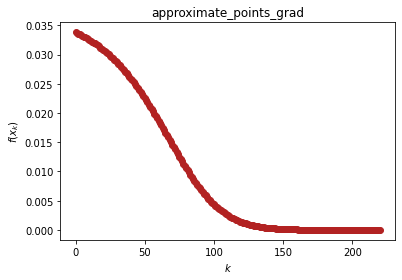
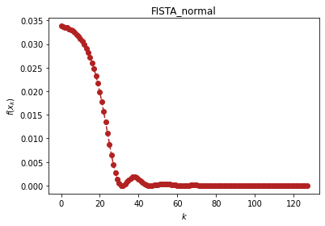
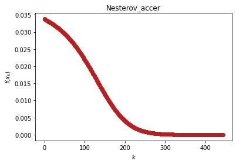

```python
import optimtool as oo
from optimtool.base import np, sp, plt
```

# 混合优化算法（optimtool.hybrid）

```python
import optimtool.hybrid as oh
oh.[方法名].[函数名]([目标函数], [参数表], [初始迭代点], [正则化参数], [邻近算子名])
```
$$
\phi(x) = f(x) + h(x)
$$

其中$f(x)$是可微的。$h(x)$不是可微的，并且具备简单的形式。optimtool.hybrid能够选择的$h(x)$有：$||x||_1$, $||x||_2$, $-\sum_{i}{\ln(x_i)}$，实例：

$$
f(x)=\sum_{i=1}^{n}((n-\sum_{j=1}^{n}\cos x_j)+i(1-\cos x_i)-\sin x_i)^2, x_0=[0.2, 0.2, ...,0.2]
$$

```python
import optimtool.hybrid as oh
x = sp.symbols("x1:3")
f = (2 - (sp.cos(x[0]) + sp.cos(x[1])) + (1 - sp.cos(x[0])) - sp.sin(x[0]))**2 + \
    (2 - (sp.cos(x[0]) + sp.cos(x[1])) + 2 * (1 - sp.cos(x[1])) - sp.sin(x[1]))**2
x_0 = (0.2, 0.2) # Random given
```

## 近似点算法（approt）

```python
oh.approt.[函数名]([目标函数], [参数表], [初始迭代点], [正则化参数], [邻近算子名])
```

| 方法头                                                                                                                                 | 解释                                   |
| ----------------------------------------------------------------------------------------------------------------------------------- | ------------------------------------ |
| grad(funcs: FuncArray, args: ArgArray, x_0: PointArray, mu: float=1e-3, proxim: str="L1", tk: float=0.02, verbose: bool=False, draw: bool=True, output_f: bool=False, epsilon: float=1e-4, k: int=0) -> OutputType | 基于梯度方法的邻近近似 |

```python
oh.approt.grad(f, x, x_0, verbose=True)
```

```text
(0.2, 0.2)	0.033830304000793295	0
[0.19925643 0.19925643]	0.03371630105707655	1
[0.19849759 0.19849759]	0.033599113758384015	2
[0.19772323 0.19772323]	0.0334786576252087	3
[0.19693311 0.19693311]	0.03335484671764522	4
[0.19612697 0.19612697]	0.03322759368760871	5
[0.19530458 0.19530458]	0.03309680983956681	6
[0.19446568 0.19446568]	0.032962405200405005	7
[0.19361004 0.19361004]	0.03282428859906577	8
[0.19273741 0.19273741]	0.03268236775663266	9
[0.19184754 0.19184754]	0.03253654938754205	10
[0.19094021 0.19094021]	0.03238673931263206	11
[0.19001517 0.19001517]	0.03223284258474419	12
[0.18907219 0.18907219]	0.032074763627614224	13
[0.18811105 0.18811105]	0.031912406388790386	14
[0.18713151 0.18713151]	0.03174567450732931	15
[0.18613337 0.18613337]	0.03157447149700892	16
[0.1851164 0.1851164]	0.03139870094579865	17
[0.18408039 0.18408039]	0.031218266732314086	18
[0.18302515 0.18302515]	0.03103307325995774	19
[0.18195048 0.18195048]	0.03084302570942143	20
[0.18085618 0.18085618]	0.030648030310189818	21
[0.17974209 0.17974209]	0.03044799463163445	22
[0.17860802 0.17860802]	0.030242827894225312	23
[0.17745382 0.17745382]	0.030032441301325655	24
[0.17627935 0.17627935]	0.029816748391938645	25
[0.17508445 0.17508445]	0.029595665414685356	26
[0.17386901 0.17386901]	0.029369111723178076	27
[0.17263291 0.17263291]	0.029137010192819283	28
[0.17137605 0.17137605]	0.028899287658918093	29
[0.17009835 0.17009835]	0.028655875375845567	30
[0.16879974 0.16879974]	0.02840670949677072	31
[0.16748017 0.16748017]	0.02815173157332011	32
[0.1661396 0.1661396]	0.02789088907428339	33
[0.16477802 0.16477802]	0.027624135922245694	34
[0.16339543 0.16339543]	0.02735143304677512	35
[0.16199186 0.16199186]	0.02707274895251694	36
[0.16056734 0.16056734]	0.026788060300246677	37
[0.15912196 0.15912196]	0.026497352498637897	38
[0.15765579 0.15765579]	0.02620062030415762	39
[0.15616897 0.15616897]	0.025897868426188044	40
[0.15466162 0.15466162]	0.02558911213410671	41
[0.15313393 0.15313393]	0.025274377862715594	42
[0.15158608 0.15158608]	0.024953703812053064	43
[0.15001829 0.15001829]	0.024627140537261723	44
[0.14843083 0.14843083]	0.02429475152384472	45
[0.14682398 0.14682398]	0.023956613743302973	46
[0.14519804 0.14519804]	0.023612818183825806	47
[0.14355337 0.14355337]	0.023263470350419237	48
[0.14189035 0.14189035]	0.02290869072858788	49
[0.14020939 0.14020939]	0.022548615205470916	50
[0.13851092 0.13851092]	0.022183395442150533	51
[0.13679544 0.13679544]	0.02181319919073435	52
[0.13506345 0.13506345]	0.021438210549756025	53
[0.13331551 0.13331551]	0.021058630151454174	54
[0.13155219 0.13155219]	0.020674675274577677	55
[0.12977412 0.12977412]	0.02028657987655194	56
[0.12798195 0.12798195]	0.01989459453910834	57
[0.12617636 0.12617636]	0.019498986321851795	58
[0.12435809 0.12435809]	0.01910003851871226	59
[0.12252788 0.12252788]	0.01869805031281132	60
[0.12068653 0.12068653]	0.01829333632594862	61
[0.11883487 0.11883487]	0.01788622605971978	62
[0.11697374 0.11697374]	0.01747706322615784	63
[0.11510403 0.11510403]	0.017066204966793598	64
[0.11322666 0.11322666]	0.016654020960107936	65
[0.11134258 0.11134258]	0.016240892418513574	66
[0.10945276 0.10945276]	0.01582721097723825	67
[0.10755818 0.10755818]	0.015413377478760959	68
[0.10565989 0.10565989]	0.01499980065777625	69
[0.10375891 0.10375891]	0.014586895732992659	70
[0.1018563 0.1018563]	0.014175082913403667	71
[0.09995316 0.09995316]	0.013764785827967332	72
[0.09805056 0.09805056]	0.013356429888878502	73
[0.09614962 0.09614962]	0.012950440599784873	74
[0.09425145 0.09425145]	0.01254724182137033	75
[0.09235718 0.09235718]	0.012147254007661526	76
[0.09046792 0.09046792]	0.011750892427213808	77
[0.08858482 0.08858482]	0.011358565383947966	78
[0.08670899 0.08670899]	0.01097067245284757	79
[0.08484156 0.08484156]	0.010587602745955627	80
[0.08298365 0.08298365]	0.010209733224125174	81
[0.08113635 0.08113635]	0.009837427069776122	82
[0.07930076 0.07930076]	0.009471032135477047	83
[0.07747796 0.07747796]	0.009110879482523235	84
[0.07566899 0.07566899]	0.008757282022810418	85
[0.07387489 0.07387489]	0.008410533276236762	86
[0.07209667 0.07209667]	0.008070906254602977	87
[0.07033531 0.07033531]	0.007738652481558527	88
[0.06859176 0.06859176]	0.007414001156570364	89
[0.06686694 0.06686694]	0.007097158469209606	90
[0.06516172 0.06516172]	0.0067883070682847125	91
[0.06347696 0.06347696]	0.006487605688524489	92
[0.06181345 0.06181345]	0.006195188935681534	93
[0.06017198 0.06017198]	0.005911167229092196	94
[0.05855326 0.05855326]	0.005635626898953724	95
[0.05695796 0.05695796]	0.005368630433870282	96
[0.05538674 0.05538674]	0.005110216872624309	97
[0.05384017 0.05384017]	0.004860402332652406	98
[0.0523188 0.0523188]	0.004619180666398659	99
[0.05082312 0.05082312]	0.004386524235562022	100
[0.04935359 0.04935359]	0.004162384792297757	101
[0.0479106 0.0479106]	0.003946694455662684	102
[0.04649451 0.04649451]	0.003739366771024543	103
[0.04510562 0.04510562]	0.0035402978397843406	104
[0.0437442 0.0437442]	0.0033493675065847757	105
[0.04241045 0.04241045]	0.0031664405911896133	106
[0.04110454 0.04110454]	0.0029913681524116327	107
[0.0398266 0.0398266]	0.002823988771812003	108
[0.0385767 0.0385767]	0.0026641298453995883	109
[0.03735488 0.03735488]	0.0025116088721840162	110
[0.03616115 0.03616115]	0.0023662347291712976	111
[0.03499544 0.03499544]	0.002227808923221081	112
[0.03385768 0.03385768]	0.002096126811077554	113
[0.03274776 0.03274776]	0.001970978779829355	114
[0.03166552 0.03166552]	0.0018521513810318142	115
[0.03061077 0.03061077]	0.0017394284127048485	116
[0.0295833 0.0295833]	0.0016325919444068876	117
[0.02858286 0.02858286]	0.0015314232815397497	118
[0.02760917 0.02760917]	0.001435703865969758	119
[0.02666194 0.02666194]	0.0013452161109320454	120
[0.02574084 0.02574084]	0.0012597441690125495	121
[0.02484552 0.02484552]	0.001179074632770029	122
[0.02397562 0.02397562]	0.001102997168258484	123
[0.02313076 0.02313076]	0.0010313050823431134	124
[0.02231052 0.02231052]	0.0009637958252554067	125
[0.0215145 0.0215145]	0.0009002714303206027	126
[0.02074227 0.02074227]	0.0008405388932003743	127
[0.01999338 0.01999338]	0.0007844104933347607	128
[0.01926738 0.01926738]	0.0007317040605428159	129
[0.01856381 0.01856381]	0.0006822431899514119	130
[0.01788221 0.01788221]	0.0006358574085730946	131
[0.01722209 0.01722209]	0.0005923822969516482	132
[0.01658299 0.01658299]	0.0005516595693425212	133
[0.01596441 0.01596441]	0.0005135371158985923	134
[0.01536588 0.01536588]	0.00047786901029846864	135
[0.01478692 0.01478692]	0.0004445154861861646	136
[0.01422703 0.01422703]	0.0004133428856947098	137
[0.01368574 0.01368574]	0.0003842235832073654	138
[0.01316255 0.01316255]	0.0003570358873697328	139
[0.01265701 0.01265701]	0.00033166392421483536	140
[0.01216862 0.01216862]	0.0003079975040960318	141
[0.01169692 0.01169692]	0.00028593197495247396	142
[0.01124144 0.01124144]	0.00026536806425459664	143
[0.01080172 0.01080172]	0.0002462117117987103	144
[0.01037731 0.01037731]	0.00022837389534282435	145
[0.00996775 0.00996775]	0.00021177045090091796	146
[0.00957262 0.00957262]	0.0001963218893420302	147
[0.00919146 0.00919146]	0.00018195321077671775	148
[0.00882387 0.00882387]	0.000168593718055502	149
[0.00846941 0.00846941]	0.00015617683055352998	150
[0.00812768 0.00812768]	0.0001446398992749004	151
[0.00779828 0.00779828]	0.0001339240241768505	152
[0.00748082 0.00748082]	0.00012397387449037303	153
[0.0071749 0.0071749]	0.000114737512699174	154
[0.00688016 0.00688016]	0.00010616622273352944	155
[0.00659622 0.00659622]	9.821434283851575e-05	156
[0.00632274 0.00632274]	9.08391034888525e-05	157
[0.00605935 0.00605935]	8.400047064208593e-05	158
[0.00580573 0.00580573]	7.766099455120823e-05	159
[0.00556154 0.00556154]	7.17856642930692e-05	160
[0.00532645 0.00532645]	6.63417681125835e-05	161
[0.00510016 0.00510016]	6.129875963233148e-05	162
[0.00488236 0.00488236]	5.6628129933378544e-05	163
[0.00467276 0.00467276]	5.23032854751192e-05	164
[0.00447106 0.00447106]	4.829943178895962e-05	165
[0.00427699 0.00427699]	4.459346285271314e-05	166
[0.00409028 0.00409028]	4.116385602937666e-05	167
[0.00391066 0.00391066]	3.799057243413012e-05	168
[0.00373789 0.00373789]	3.505496257755243e-05	169
[0.00357171 0.00357171]	3.2339677120730474e-05	170
[0.0034119 0.0034119]	2.982858256774279e-05	171
[0.0032582 0.0032582]	2.7506681714183043e-05	172
[0.00311041 0.00311041]	2.5360038665186197e-05	173
[0.00296831 0.00296831]	2.337570823368496e-05	174
[0.00283169 0.00283169]	2.154166952822405e-05	175
[0.00270034 0.00270034]	1.9846763539975257e-05	176
[0.00257407 0.00257407]	1.8280634540178872e-05	177
[0.00245269 0.00245269]	1.6833675101623048e-05	178
[0.00233602 0.00233602]	1.549697456151136e-05	179
[0.00222389 0.00222389]	1.4262270747130963e-05	180
[0.00211612 0.00211612]	1.3121904790621107e-05	181
[0.00201254 0.00201254]	1.206877886445294e-05	182
[0.00191301 0.00191301]	1.1096316674962034e-05	183
[0.00181737 0.00181737]	1.0198426557197656e-05	184
[0.00172546 0.00172546]	9.36946702044605e-06	185
[0.00163716 0.00163716]	8.60421460020984e-06	186
[0.00155231 0.00155231]	7.897833878607748e-06	187
[0.0014708 0.0014708]	7.245849541505941e-06	188
[0.00139249 0.00139249]	6.644120347093789e-06	189
[0.00131725 0.00131725]	6.088814886589323e-06	190
[0.00124498 0.00124498]	5.576389024080719e-06	191
[0.00117555 0.00117555]	5.103564908254004e-06	192
[0.00110886 0.00110886]	4.667311454629785e-06	193
[0.0010448 0.0010448]	4.26482620251418e-06	194
[0.00098327 0.00098327]	3.89351845623686e-06	195
[0.00092417 0.00092417]	3.5509936254760143e-06	196
[0.00086741 0.00086741]	3.2350386844359184e-06	197
[0.00081289 0.00081289]	2.9436086744619057e-06	198
[0.00076053 0.00076053]	2.6748141791812922e-06	199
[0.00071025 0.00071025]	2.4269097056574906e-06	200
[0.00066196 0.00066196]	2.1982829091729086e-06	201
[0.00061559 0.00061559]	1.9874446031613262e-06	202
[0.00057106 0.00057106]	1.7930194995873036e-06	203
[0.00052829 0.00052829]	1.613737628526414e-06	204
[0.00048723 0.00048723]	1.4484263891181658e-06	205
[0.0004478 0.0004478]	1.2960031871400677e-06	206
[0.00040993 0.00040993]	1.1554686174483923e-06	207
[0.00037357 0.00037357]	1.025900152341892e-06	208
[0.00033867 0.00033867]	9.064462994919141e-07	209
[0.00030515 0.00030515]	7.963211955915816e-07	210
[0.00027296 0.00027296]	6.947996041620743e-07	211
[0.00024206 0.00024206]	6.01212288158414e-07	212
[0.00021239 0.00021239]	5.14941730029167e-07	213
[0.00018391 0.00018391]	4.3541817380762416e-07	214
[0.00015656 0.00015656]	3.621159655820409e-07	215
[0.0001303 0.0001303]	2.9455017038155757e-07	216
[0.0001051 0.0001051]	2.3227344505032461e-07	217
[8.08945057e-05 8.08945057e-05]	1.748731481504906e-07	218
[5.76602959e-05 5.76602959e-05]	1.2196866929042707e-07	219
[3.53546819e-05 3.53546819e-05]	7.320896153659465e-08	220
```

<p align="center">
    <a href=""> 
         
    </a>
</p>

```text
(array([3.53546819e-05, 3.53546819e-05]), 220)
```

## FISTA算法（fista）

```python
oh.fista.[函数名]([目标函数], [参数表], [初始迭代点], [正则化参数], [邻近算子名])
```

| 方法头                                                                                                                                 | 解释                                   |
| ----------------------------------------------------------------------------------------------------------------------------------- | ------------------------------------ |
| normal(funcs: FuncArray, args: ArgArray, x_0: PointArray, mu: float=1e-3, proxim: str="L1", tk: float=0.02, verbose: bool=False, draw: bool=True, output_f: bool=False, epsilon: float=1e-4, k: int=0) -> OutputType | 两步计算一个新点 |
| variant(funcs: FuncArray, args: ArgArray, x_0: PointArray, mu: float=1e-3, proxim: str="L1", tk: float=0.02, verbose: bool=False, draw: bool=True, output_f: bool=False, epsilon: float=1e-4, k: int=0) -> OutputType | normal法的等价变形 |
| decline(funcs: FuncArray, args: ArgArray, x_0: PointArray, mu: float=1e-3, proxim: str="L1", tk: float=0.02, verbose: bool=False, draw: bool=True, output_f: bool=False, epsilon: float=1e-4, k: int=0) -> OutputType | 基于函数下降趋势的变体 |

```python
oh.fista.normal(f, x, x_0, verbose=True)
```

```text
(0.2, 0.2)	0.033830304000793295	0
[0.19925643 0.19925643]	0.03371630105707655	1
[0.19849759 0.19849759]	0.033599113758384015	2
[0.19752965 0.19752965]	0.03344840822740475	3
[0.19634058 0.19634058]	0.03326140386972337	4
[0.19491599 0.19491599]	0.03303467660717308	5
[0.19323907 0.19323907]	0.03276408584834668	6
[0.19129038 0.19129038]	0.03244469143441093	7
[0.18904782 0.18904782]	0.03207066253319544	8
[0.18648645 0.18648645]	0.03163518232735821	9
[0.18357846 0.18357846]	0.031130355220309	10
[0.18029315 0.18029315]	0.03054712756229315	11
[0.17659697 0.17659697]	0.02987523906813377	12
[0.17245376 0.17245376]	0.029103230710925534	13
[0.16782507 0.16782507]	0.028218546457533245	14
[0.16267078 0.16267078]	0.02720778105084813	15
[0.15695006 0.15695006]	0.02605714379032019	16
[0.15062263 0.15062263]	0.02475322722482501	17
[0.1436507 0.1436507]	0.023284185711105593	18
[0.13600142 0.13600142]	0.02164143378200551	19
[0.12765019 0.12765019]	0.019821954357666566	20
[0.11858478 0.11858478]	0.017831241286453643	21
[0.10881027 0.10881027]	0.01568676317570666	22
[0.09835481 0.09835481]	0.01342160091785943	23
[0.08727586 0.08727586]	0.01108757276749394	24
[0.0756663 0.0756663]	0.008756758818819103	25
[0.06365966 0.06365966]	0.006519996602965627	26
[0.05143318 0.05143318]	0.004480874877680786	27
[0.03920737 0.03920737]	0.0027443108743679394	28
[0.0272407 0.0272407]	0.0014001940854970719	29
[0.01581839 0.01581839]	0.0005047242448837863	30
[0.00523537 0.00523537]	6.4288746819883e-05	31
[-0.00418665 -0.00418665]	4.3944790650174575e-05	32
[-0.01221648 -0.01221648]	0.0003358041809499229	33
[-0.01868558 -0.01868558]	0.000782018176888592	34
[-0.02349934 -0.02349934]	0.001243963960329223	35
[-0.02664181 -0.02664181]	0.001608014900872538	36
[-0.02817331 -0.02817331]	0.0018038384618738578	37
[-0.02822152 -0.02822152]	0.001810201114210672	38
[-0.02696779 -0.02696779]	0.0016486746491471192	39
[-0.02463074 -0.02463074]	0.0013692472198611092	40
[-0.02144946 -0.02144946]	0.001033310326812164	41
[-0.01766789 -0.01766789]	0.0006987912458611627	42
[-0.01352189 -0.01352189]	0.0004102193974182509	43
[-0.00922928 -0.00922928]	0.0001943611548287423	44
[-0.00498303 -0.00498303]	6.0496796608013615e-05	45
[-0.00094732 -0.00094732]	3.6954413794614425e-06	46
[0.00270463 0.00270463]	1.9901129925390336e-05	47
[0.00587664 0.00587664]	7.94091094216332e-05	48
[0.00850264 0.00850264]	0.00015732135728718983	49
[0.01054374 0.01054374]	0.00023529252758100567	50
[0.01198517 0.01198517]	0.00029932348310261373	51
[0.0128333 0.0128333]	0.00034041104566886213	52
[0.01311286 0.01311286]	0.0003545027009827691	53
[0.01286437 0.01286437]	0.0003419638510109866	54
[0.01214176 0.01214176]	0.0003067200850132879	55
[0.01100998 0.01100998]	0.00025519907496466464	56
[0.0095427 0.0095427]	0.00019517498982886958	57
[0.00781981 0.00781981]	0.00013461228868992265	58
[0.00592486 0.00592486]	8.060873795925052e-05	59
[0.00394224 0.00394224]	3.853955135280601e-05	60
[0.00195435 0.00195435]	1.149547685501415e-05	61
[3.86693674e-05 3.86693674e-05]	8.032897007816521e-08	62
[-0.00169515 -0.00169515]	9.17148721695113e-06	63
[-0.00319296 -0.00319296]	2.7004334602874763e-05	64
[-0.00441392 -0.00441392]	4.8397238412822366e-05	65
[-0.00533136 -0.00533136]	6.857481635587594e-05	66
[-0.00593302 -0.00593302]	8.373629979419888e-05	67
[-0.0062205 -0.0062205]	9.15235913915823e-05	68
[-0.0062082 -0.0062082]	9.118306879630649e-05	69
[-0.00592161 -0.00592161]	8.34343820763833e-05	70
[-0.0053953 -0.0053953]	7.01133065277566e-05	71
[-0.00467068 -0.00467068]	5.368776346101515e-05	72
[-0.00379356 -0.00379356]	3.6752630190872105e-05	73
[-0.00281189 -0.00281189]	2.1593233635829933e-05	74
[-0.00177358 -0.00177358]	9.877481468752762e-06	75
[-0.00072459 -0.00072459]	2.501921465760068e-06	76
[0.00025271 0.00025271]	6.330306539194115e-07	77
[0.00112552 0.00112552]	4.7746896689738605e-06	78
[0.00186791 0.00186791]	1.0668443587263032e-05	79
[0.00246108 0.00246108]	1.6931895980111533e-05	80
[0.00289345 0.00289345]	2.2361878461997472e-05	81
[0.00316041 0.00316041]	2.6076758170315184e-05	82
[0.00326391 0.00326391]	2.7591230673255495e-05	83
[0.00321191 0.00321191]	2.682517662881479e-05	84
[0.00301765 0.00301765]	2.405576611892222e-05	85
[0.00269879 0.00269879]	1.9827263265911833e-05	86
[0.00227655 0.00227655]	1.4835994988390612e-05	87
[0.00177463 0.00177463]	9.808812559984457e-06	88
[0.00121826 0.00121826]	5.392209040060288e-06	89
[0.00063314 0.00063314]	2.0662326628037452e-06	90
[4.4412847e-05 4.4412847e-05]	9.277008269260652e-08	91
[-0.00048426 -0.00048426]	1.4383293148952407e-06	92
[-0.00093604 -0.00093604]	3.6301580781364767e-06	93
[-0.00129827 -0.00129827]	5.9828727580486845e-06	94
[-0.00156272 -0.00156272]	8.03638649505745e-06	95
[-0.00172564 -0.00172564]	9.442956816861173e-06	96
[-0.00178759 -0.00178759]	1.000614664689354e-05	97
[-0.00175314 -0.00175314]	9.691006528007353e-06	98
[-0.0016304 -0.0016304]	8.607546021477958e-06	99
[-0.00143044 -0.00143044]	6.973690459175214e-06	100
[-0.00116663 -0.00116663]	5.066443040807669e-06	101
[-0.00085394 -0.00085394]	3.170660486780329e-06	102
[-0.0005082 -0.0005082]	1.5338563099619648e-06	103
[-0.00014544 -0.00014544]	3.33212610205221e-07	104
[0.00017878 0.00017878]	4.214390667731358e-07	105
[0.00045421 0.00045421]	1.3203776625245732e-06	106
[0.00067324 0.00067324]	2.250832733219641e-06	107
[0.00083097 0.00083097]	3.038967555581645e-06	108
[0.00092526 0.00092526]	3.557218652962131e-06	109
[0.00095658 0.00095658]	3.737100302233256e-06	110
[0.0009278 0.0009278]	3.5716314819327603e-06	111
[0.00084399 0.00084399]	3.1084058923828957e-06	112
[0.00071203 0.00071203]	2.4354998352661786e-06	113
[0.00054025 0.00054025]	1.6631435338735005e-06	114
[0.00033803 0.00033803]	9.043319121947985e-07	115
[0.00011537 0.00011537]	2.573406355634432e-07	116
[-7.75729405e-05 -7.75729405e-05]	1.671842709922099e-07	117
[-0.00023501 -0.00023501]	5.805689223087464e-07	118
[-0.00035294 -0.00035294]	9.55330129339356e-07	119
[-0.00042919 -0.00042919]	1.2273575895614658e-06	120
[-0.00046338 -0.00046338]	1.3569078800428007e-06	121
[-0.00045682 -0.00045682]	1.3316868956475513e-06	122
[-0.00041237 -0.00041237]	1.1653229296710031e-06	123
[-0.0003342 -0.0003342]	8.920309869145119e-07	124
[-0.00022756 -0.00022756]	5.587686146122985e-07	125
[-9.85008103e-05 -9.85008103e-05]	2.1641313021020493e-07	126
[6.43207414e-06 6.43207414e-06]	1.2946889566740209e-08	127
```

<p align="center">
    <a href=""> 
         
    </a>
</p>

```text
(array([6.43207414e-06, 6.43207414e-06]), 127)
```

## Nesterov算法（nesterov）

```python
oh.nesterov.[函数名]([目标函数], [参数表], [初始迭代点], [正则化参数], [邻近算子名])
```

| 方法头                                                                                                                                 | 解释                                   |
| ----------------------------------------------------------------------------------------------------------------------------------- | ------------------------------------ |
| seckin(funcs: FuncArray, args: ArgArray, x_0: PointArray, mu: float=1e-3, proxim: str="L1", tk: float=0.02, verbose: bool=False, draw: bool=True, output_f: bool=False, epsilon: float=1e-4, k: int=0) -> OutputType | 第二类Nesterov加速法 |
| accer(funcs: FuncArray, args: ArgArray, x_0: PointArray, mu: float=1e-3, proxim: str="L1", lk: float=0.01, tk: float=0.02, verbose: bool=False, draw: bool=True, output_f: bool=False, epsilon: float=1e-4, k: int=0) -> OutputType | 复合优化算法的加速框架 |

```python
oh.nesterov.accer(f, x, x_0, verbose=True)
```

```text
(0.2, 0.2)	0.033830304000793295	0
[0.19925643 0.19925643]	0.03371630105707655	1
[0.19873208 0.19873208]	0.033635416161269645	2
[0.19824625 0.19824625]	0.033560113282182814	3
[0.19779193 0.19779193]	0.03348937977771688	4
[0.1973583 0.1973583]	0.03342158708171633	5
[0.19693596 0.19693596]	0.03335529505960039	6
[0.19651836 0.19651836]	0.03328949344326663	7
[0.19610149 0.19610149]	0.03322355499940229	8
[0.19568304 0.19568304]	0.033157115543780515	9
[0.19526174 0.19526174]	0.033089970332591104	10
[0.19483691 0.19483691]	0.033022004801464444	11
[0.19440817 0.19440817]	0.032953153342586375	12
[0.19397531 0.19397531]	0.03288337625764423	13
[0.19353821 0.19353821]	0.032812647334081416	14
[0.1930968 0.1930968]	0.03274094729563452	15
[0.19265102 0.19265102]	0.03266826039819621	16
[0.19220083 0.19220083]	0.032594572677139846	17
[0.19174619 0.19174619]	0.032519871051184146	18
[0.19128706 0.19128706]	0.03244414286707404	19
[0.19082343 0.19082343]	0.032367375670024706	20
[0.19035525 0.19035525]	0.0322895570894612	21
[0.1898825 0.1898825]	0.03221067478356757	22
[0.18940514 0.18940514]	0.03213071641385224	23
[0.18892316 0.18892316]	0.03204966963507849	24
[0.18843651 0.18843651]	0.031967522093123764	25
[0.18794517 0.18794517]	0.03188426142698723	26
[0.18744912 0.18744912]	0.03179987527304022	27
[0.18694832 0.18694832]	0.031714351270546136	28
[0.18644275 0.18644275]	0.03162767706796477	29
[0.18593238 0.18593238]	0.03153984032980098	30
[0.18541719 0.18541719]	0.03145082874386781	31
[0.18489715 0.18489715]	0.03136063002891287	32
[0.18437222 0.18437222]	0.03126923194257793	33
[0.1838424 0.1838424]	0.031176622289681582	34
[0.18330765 0.18330765]	0.03108278893081914	35
[0.18276794 0.18276794]	0.03098771979128425	36
[0.18222326 0.18222326]	0.03089140287031154	37
[0.18167359 0.18167359]	0.030793826250645626	38
[0.18111889 0.18111889]	0.030694978108438714	39
[0.18055915 0.18055915]	0.03059484672348252	40
[0.17999435 0.17999435]	0.030493420489773625	41
[0.17942446 0.17942446]	0.030390687926420742	42
[0.17884946 0.17884946]	0.03028663768889194	43
[0.17826935 0.17826935]	0.030181258580608418	44
[0.17768409 0.17768409]	0.030074539564881035	45
[0.17709367 0.17709367]	0.02996646977719818	46
[0.17649807 0.17649807]	0.029857038537858628	47
[0.17589728 0.17589728]	0.02974623536495526	48
[0.17529127 0.17529127]	0.02963404998770624	49
[0.17468005 0.17468005]	0.029520472360134945	50
[0.17406359 0.17406359]	0.029405492675093462	51
[0.17344188 0.17344188]	0.029289101378632255	52
[0.1728149 0.1728149]	0.029171289184710302	53
[0.17218266 0.17218266]	0.029052047090239855	54
[0.17154513 0.17154513]	0.028931366390468057	55
[0.17090231 0.17090231]	0.028809238694680148	56
[0.17025419 0.17025419]	0.028685655942228945	57
[0.16960076 0.16960076]	0.028560610418873568	58
[0.16894202 0.16894202]	0.028434094773425688	59
[0.16827797 0.16827797]	0.028306102034691773	60
[0.1676086 0.1676086]	0.02817662562869971	61
[0.16693391 0.16693391]	0.028045659396202398	62
[0.1662539 0.1662539]	0.027913197610440834	63
[0.16556856 0.16556856]	0.0277792349951582	64
[0.16487791 0.16487791]	0.027643766742844578	65
[0.16418194 0.16418194]	0.027506788533203375	66
[0.16348066 0.16348066]	0.02736829655181286	67
[0.16277408 0.16277408]	0.02722828750897477	68
[0.1620622 0.1620622]	0.027086758658721198	69
[0.16134503 0.16134503]	0.02694370781796281	70
[0.16062258 0.16062258]	0.026799133385756447	71
[0.15989486 0.15989486]	0.026653034362663773	72
[0.1591619 0.1591619]	0.026505410370182444	73
[0.15842369 0.15842369]	0.026356261670214508	74
[0.15768027 0.15768027]	0.026205589184552146	75
[0.15693165 0.15693165]	0.026053394514344092	76
[0.15617784 0.15617784]	0.02589967995951506	77
[0.15541887 0.15541887]	0.025744448538108148	78
[0.15465477 0.15465477]	0.02558770400550724	79
[0.15388556 0.15388556]	0.025429450873514402	80
[0.15311126 0.15311126]	0.0252696944292389	81
[0.15233191 0.15233191]	0.02510844075376142	82
[0.15154753 0.15154753]	0.0249456967405326	83
[0.15075817 0.15075817]	0.024781470113468172	84
[0.14996385 0.14996385]	0.024615769444693614	85
[0.14916461 0.14916461]	0.02444860417189907	86
[0.14836049 0.14836049]	0.024279984615258984	87
[0.14755153 0.14755153]	0.02410992199386683	88
[0.14673778 0.14673778]	0.023938428441643678	89
[0.14591927 0.14591927]	0.02376551702266892	90
[0.14509606 0.14509606]	0.023591201745887268	91
[0.14426819 0.14426819]	0.02341549757913816	92
[0.14343572 0.14343572]	0.023238420462463397	93
[0.1425987 0.1425987]	0.02305998732063617	94
[0.14175718 0.14175718]	0.022880216074865917	95
[0.14091122 0.14091122]	0.022699125653621477	96
[0.14006088 0.14006088]	0.022516736002528296	97
[0.13920622 0.13920622]	0.022333068093279024	98
[0.13834731 0.13834731]	0.022148143931513993	99
[0.13748421 0.13748421]	0.02196198656361456	100
[0.136617 0.136617]	0.021774620082362042	101
[0.13574573 0.13574573]	0.02158606963140784	102
[0.13487049 0.13487049]	0.02139636140851093	103
[0.13399135 0.13399135]	0.02120552266748679	104
[0.13310839 0.13310839]	0.021013581718826876	105
[0.13222168 0.13222168]	0.020820567928938712	106
[0.13133131 0.13133131]	0.020626511717963182	107
[0.13043736 0.13043736]	0.02043144455612627	108
[0.12953992 0.12953992]	0.020235398958584165	109
[0.12863908 0.12863908]	0.02003840847872382	110
[0.12773492 0.12773492]	0.01984050769987993	111
[0.12682754 0.12682754]	0.019641732225440522	112
[0.12591704 0.12591704]	0.019442118667302975	113
[0.1250035 0.1250035]	0.019241704632659312	114
[0.12408704 0.12408704]	0.019040528709081284	115
[0.12316775 0.12316775]	0.018838630447888367	116
[0.12224573 0.12224573]	0.018636050345776825	117
[0.12132109 0.12132109]	0.018432829824700743	118
[0.12039394 0.12039394]	0.01822901120999248	119
[0.11946438 0.11946438]	0.01802463770671741	120
[0.11853253 0.11853253]	0.017819753374264793	121
[0.1175985 0.1175985]	0.017614403099174197	122
[0.11666241 0.11666241]	0.017408632566209822	123
[0.11572436 0.11572436]	0.01720248822769215	124
[0.11478448 0.11478448]	0.016996017271108478	125
[0.11384289 0.11384289]	0.016789267585023703	126
[0.11289972 0.11289972]	0.016582287723316894	127
[0.11195507 0.11195507]	0.01637512686778442	128
[0.11100909 0.11100909]	0.016167834789139506	129
[0.11006189 0.11006189]	0.015960461806458145	130
[0.1091136 0.1091136]	0.015753058745119824	131
[0.10816436 0.10816436]	0.015545676893292247	132
[0.10721428 0.10721428]	0.015338367957028396	133
[0.10626351 0.10626351]	0.015131184014033131	134
[0.10531218 0.10531218]	0.014924177466172134	135
[0.10436042 0.10436042]	0.014717400990799457	136
[0.10340836 0.10340836]	0.014510907490978745	137
[0.10245615 0.10245615]	0.014304750044688593	138
[0.10150391 0.10150391]	0.014098981853094075	139
[0.10055179 0.10055179]	0.013893656187982946	140
[0.09959992 0.09959992]	0.01368882633845935	141
[0.09864844 0.09864844]	0.013484545556998294	142
[0.09769749 0.09769749]	0.013280867004964954	143
[0.09674722 0.09674722]	0.013077843697704697	144
[0.09579776 0.09579776]	0.01287552844931507	145
[0.09484925 0.09484925]	0.01267397381721372	146
[0.09390183 0.09390183]	0.012473232046613741	147
[0.09295564 0.09295564]	0.012273355015029202	148
[0.09201083 0.09201083]	0.012074394176923015	149
[0.09106754 0.09106754]	0.011876400508619371	150
[0.09012589 0.09012589]	0.011679424453601839	151
[0.08918605 0.08918605]	0.011483515868314823	152
[0.08824814 0.08824814]	0.01128872396858924	153
[0.0873123 0.0873123]	0.011095097276812349	154
[0.08637867 0.08637867]	0.010902683569959014	155
[0.0854474 0.0854474]	0.010711529828601291	156
[0.08451862 0.08451862]	0.01052168218701202	157
[0.08359246 0.08359246]	0.010333185884471796	158
[0.08266906 0.08266906]	0.01014608521789343	159
[0.08174856 0.08174856]	0.00996042349586558	160
[0.08083108 0.08083108]	0.009776242994221208	161
[0.07991677 0.07991677]	0.009593584913228696	162
[0.07900575 0.07900575]	0.009412489336499564	163
[0.07809816 0.07809816]	0.009232995191701765	164
[0.07719411 0.07719411]	0.009055140213166078	165
[0.07629375 0.07629375]	0.008878960906460193	166
[0.07539718 0.07539718]	0.008704492515007505	167
[0.07450455 0.07450455]	0.008531768988817391	168
[0.07361596 0.07361596]	0.008360822955386055	169
[0.07273153 0.07273153]	0.008191685692826979	170
[0.0718514 0.0718514]	0.008024387105275749	171
[0.07097566 0.07097566]	0.007858955700613185	172
[0.07010445 0.07010445]	0.007695418570540102	173
[0.06923786 0.06923786]	0.007533801373033395	174
[0.068376 0.068376]	0.007374128317203251	175
[0.06751899 0.06751899]	0.007216422150565665	176
[0.06666693 0.06666693]	0.007060704148737249	177
[0.06581992 0.06581992]	0.006906994107553427	178
[0.06497806 0.06497806]	0.00675531033760118	179
[0.06414146 0.06414146]	0.006605669661154516	180
[0.06331019 0.06331019]	0.006458087411491039	181
[0.06248436 0.06248436]	0.006312577434564489	182
[0.06166406 0.06166406]	0.006169152092997068	183
[0.06084938 0.06084938]	0.006027822272356063	184
[0.06004039 0.06004039]	0.005888597389665743	185
[0.05923718 0.05923718]	0.005751485404107095	186
[0.05843983 0.05843983]	0.005616492829845886	187
[0.05764842 0.05764842]	0.005483624750930617	188
[0.05686301 0.05686301]	0.0053528848381917	189
[0.05608369 0.05608369]	0.00522427536807383	190
[0.05531051 0.05531051]	0.005097797243323587	191
[0.05454354 0.05454354]	0.00497345001545756	192
[0.05378285 0.05378285]	0.00485123190892543	193
[0.05302849 0.05302849]	0.004731139846886088	194
[0.05228051 0.05228051]	0.004613169478506701	195
[0.05153898 0.05153898]	0.004497315207696919	196
[0.05080394 0.05080394]	0.004383570223184056	197
[0.05007544 0.05007544]	0.004271926529837656	198
[0.04935352 0.04935352]	0.0041623749811483205	199
[0.04863823 0.04863823]	0.004054905312763828	200
[0.0479296 0.0479296]	0.003949506176988748	201
[0.04722767 0.04722767]	0.003846165178149841	202
[0.04653248 0.04653248]	0.003744868908731468	203
[0.04584405 0.04584405]	0.00364560298618641	204
[0.0451624 0.0451624]	0.003548352090325825	205
[0.04448758 0.04448758]	0.00345310000119703	206
[0.04381958 0.04381958]	0.0033598296373552653	207
[0.04315845 0.04315845]	0.003268523094439369	208
[0.04250418 0.04250418]	0.0031791616839638233	209
[0.04185681 0.04185681]	0.003091725972240079	210
[0.04121632 0.04121632]	0.0030061958193431815	211
[0.04058275 0.04058275]	0.002922550418043142	212
[0.03995608 0.03995608]	0.0028407683326218945	213
[0.03933633 0.03933633]	0.002760827537500723	214
[0.0387235 0.0387235]	0.002682705455604866	215
[0.03811758 0.03811758]	0.002606378996397809	216
[0.03751857 0.03751857]	0.0025318245935165348	217
[0.03692646 0.03692646]	0.0024590182419483536	218
[0.03634126 0.03634126]	0.0023879355346878837	219
[0.03576293 0.03576293]	0.002318551698819148	220
[0.03519148 0.03519148]	0.0022508416309721096	221
[0.03462689 0.03462689]	0.0021847799321037384	222
[0.03406913 0.03406913]	0.0021203409415594945	223
[0.0335182 0.0335182]	0.0020574987703744028	224
[0.03297407 0.03297407]	0.0019962273337760157	225
[0.03243671 0.03243671]	0.0019365003828540328	226
[0.03190611 0.03190611]	0.001878291535368826	227
[0.03138223 0.03138223]	0.001821574305668823	228
[0.03086505 0.03086505]	0.0017663221336947984	229
[0.03035453 0.03035453]	0.0017125084130502617	230
[0.02985065 0.02985065]	0.0016601065181208472	231
[0.02935337 0.02935337]	0.0016090898302279768	232
[0.02886266 0.02886266]	0.0015594317628068093	233
[0.02837848 0.02837848]	0.0015111057855995852	234
[0.02790078 0.02790078]	0.0014640854478586128	235
[0.02742955 0.02742955]	0.0014183444005574958	236
[0.02696472 0.02696472]	0.0013738564176089946	237
[0.02650626 0.02650626]	0.001330595416092694	238
[0.02605413 0.02605413]	0.001288535475496316	239
[0.02560829 0.02560829]	0.001247650855978515	240
[0.02516868 0.02516868]	0.0012079160156600926	241
[0.02473526 0.02473526]	0.0011693056269562992	242
[0.02430798 0.02430798]	0.0011317945919609778	243
[0.0238868 0.0238868]	0.0010953580568974848	244
[0.02347166 0.02347166]	0.0010599714256517984	245
[0.02306252 0.02306252]	0.001025610372404541	246
[0.02265933 0.02265933]	0.0009922508533802834	247
[0.02226202 0.02226202]	0.0009598691177337821	248
[0.02187056 0.02187056]	0.0009284417175927542	249
[0.02148488 0.02148488]	0.0008979455172794812	250
[0.02110493 0.02110493]	0.000868357701732434	251
[0.02073067 0.02073067]	0.0008396557841512164	252
[0.02036202 0.02036202]	0.0008118176128884495	253
[0.01999895 0.01999895]	0.0007848213776115862	254
[0.01964139 0.01964139]	0.0007586456147596944	255
[0.01928928 0.01928928]	0.0007332692123195464	256
[0.01894257 0.01894257]	0.0007086714139457371	257
[0.01860121 0.01860121]	0.0006848318224496608	258
[0.01826513 0.01826513]	0.0006617304026828131	259
[0.01793428 0.01793428]	0.0006393474838384433	260
[0.01760859 0.01760859]	0.0006176637611976787	261
[0.01728803 0.01728803]	0.0005966602973436125	262
[0.01697251 0.01697251]	0.0005763185228690176	263
[0.01666199 0.01666199]	0.0005566202366011656	264
[0.01635641 0.01635641]	0.0005375476053680995	265
[0.01605571 0.01605571]	0.0005190831633299191	266
[0.01575982 0.01575982]	0.0005012098108984406	267
[0.01546871 0.01546871]	0.0004839108132677776	268
[0.01518229 0.01518229]	0.0004671697985785609	269
[0.01490052 0.01490052]	0.0004509707557372565	270
[0.01462335 0.01462335]	0.00043529803191223943	271
[0.0143507 0.0143507]	0.0004201363297273299	272
[0.01408252 0.01408252]	0.00040547070417281143	273
[0.01381876 0.01381876]	0.0003912865592539738	274
[0.01355935 0.01355935]	0.0003775696443959911	275
[0.01330425 0.01330425]	0.0003643060506235078	276
[0.01305339 0.01305339]	0.00035148220653310216	277
[0.01280671 0.01280671]	0.0003390848740755047	278
[0.01256417 0.01256417]	0.0003271011441643905	279
[0.0123257 0.0123257]	0.000315518432127678	280
[0.01209124 0.01209124]	0.00030432447301666937	281
[0.01186075 0.01186075]	0.0002935073167876891	282
[0.01163416 0.01163416]	0.00028305532337051406	283
[0.01141143 0.01141143]	0.0002729571576369438	284
[0.01119249 0.01119249]	0.000263201784282491	285
[0.01097729 0.01097729]	0.00025377846263343733	286
[0.01076579 0.01076579]	0.00024467674139096147	287
[0.01055792 0.01055792]	0.0002358864533235877	288
[0.01035363 0.01035363]	0.0002273977099183539	289
[0.01015287 0.01015287]	0.0002192008960007555	290
[0.00995559 0.00995559]	0.00021128666433314824	291
[0.00976174 0.00976174]	0.00020364593020011297	292
[0.00957126 0.00957126]	0.00019626986598967865	293
[0.00938411 0.00938411]	0.00018914989577801418	294
[0.00920023 0.00920023]	0.00018227768992514276	295
[0.00901957 0.00901957]	0.00017564515968864142	296
[0.00884209 0.00884209]	0.00016924445186189735	297
[0.00866774 0.00866774]	0.0001630679434428663	298
[0.00849646 0.00849646]	0.00015710823633906235	299
[0.00832821 0.00832821]	0.00015135815211410862	300
[0.00816295 0.00816295]	0.00014581072678047656	301
[0.00800062 0.00800062]	0.00014045920564314938	302
[0.00784118 0.00784118]	0.0001352970381981069	303
[0.00768459 0.00768459]	0.00013031787308957817	304
[0.00753079 0.00753079]	0.00012551555312920109	305
[0.00737975 0.00737975]	0.00012088411038074003	306
[0.00723141 0.00723141]	0.00011641776131247725	307
[0.00708575 0.00708575]	0.00011211090202042497	308
[0.0069427 0.0069427]	0.0001079581035241948	309
[0.00680224 0.00680224]	0.00010395410713774198	310
[0.00666431 0.00666431]	0.00010009381991663805	311
[0.00652888 0.00652888]	9.637231018341094e-05	312
[0.0063959 0.0063959]	9.278480313214474e-05	313
[0.00626534 0.00626534]	8.932667651360674e-05	314
[0.00613715 0.00613715]	8.599345640158698e-05	315
[0.0060113 0.0060113]	8.27808130411733e-05	316
[0.00588774 0.00588774]	7.96845567797724e-05	317
[0.00576644 0.00576644]	7.670063408066092e-05	318
[0.00564737 0.00564737]	7.382512361986245e-05	319
[0.00553047 0.00553047]	7.105423246593916e-05	320
[0.00541572 0.00541572]	6.838429234300977e-05	321
[0.00530307 0.00530307]	6.581175597650488e-05	322
[0.0051925 0.0051925]	6.333319352139349e-05	323
[0.00508397 0.00508397]	6.094528907257019e-05	324
[0.00497744 0.00497744]	5.864483725688187e-05	325
[0.00487287 0.00487287]	5.64287399059034e-05	326
[0.00477024 0.00477024]	5.4294002809103636e-05	327
[0.00466952 0.00466952]	5.223773254648501e-05	328
[0.00457066 0.00457066]	5.025713339975743e-05	329
[0.00447363 0.00447363]	4.8349504341251034e-05	330
[0.00437841 0.00437841]	4.65122360995673e-05	331
[0.00428496 0.00428496]	4.4742808300888244e-05	332
[0.00419325 0.00419325]	4.3038786684965573e-05	333
[0.00410325 0.00410325]	4.1397820394612525e-05	334
[0.00401493 0.00401493]	3.9817639337442446e-05	335
[0.00392826 0.00392826]	3.829605161899657e-05	336
[0.00384322 0.00384322]	3.683094104558913e-05	337
[0.00375976 0.00375976]	3.542026469609136e-05	338
[0.00367787 0.00367787]	3.406205056101091e-05	339
[0.00359752 0.00359752]	3.275439524784383e-05	340
[0.00351868 0.00351868]	3.149546175131387e-05	341
[0.00344132 0.00344132]	3.028347728723066e-05	342
[0.00336541 0.00336541]	2.9116731188578645e-05	343
[0.00329094 0.00329094]	2.7993572862673044e-05	344
[0.00321787 0.00321787]	2.6912409807924855e-05	345
[0.00314617 0.00314617]	2.587170568900249e-05	346
[0.00307583 0.00307583]	2.486997846903073e-05	347
[0.00300682 0.00300682]	2.3905798597549508e-05	348
[0.00293912 0.00293912]	2.2977787252856655e-05	349
[0.0028727 0.0028727]	2.20846146376197e-05	350
[0.00280753 0.00280753]	2.1224998326240244e-05	351
[0.00274361 0.00274361]	2.0397701662919066e-05	352
[0.00268089 0.00268089]	1.9601532208991935e-05	353
[0.00261937 0.00261937]	1.883534023843161e-05	354
[0.00255901 0.00255901]	1.809801728017769e-05	355
[0.0024998 0.0024998]	1.7388494706163496e-05	356
[0.00244172 0.00244172]	1.670574236376479e-05	357
[0.00238475 0.00238475]	1.6048767251580275e-05	358
[0.00232886 0.00232886]	1.5416612237305273e-05	359
[0.00227403 0.00227403]	1.480835481659927e-05	360
[0.00222026 0.00222026]	1.4223105911786891e-05	361
[0.00216751 0.00216751]	1.366000870937832e-05	362
[0.00211576 0.00211576]	1.311823753518719e-05	363
[0.00206501 0.00206501]	1.2596996766101033e-05	364
[0.00201523 0.00201523]	1.2095519777400712e-05	365
[0.0019664 0.0019664]	1.1613067924637512e-05	366
[0.0019185 0.0019185]	1.1148929559048495e-05	367
[0.00187152 0.00187152]	1.0702419075553807e-05	368
[0.00182545 0.00182545]	1.0272875992311643e-05	369
[0.00178025 0.00178025]	9.859664061011676e-06	370
[0.00173593 0.00173593]	9.462170406882034e-06	371
[0.00169245 0.00169245]	9.079804697563365e-06	372
[0.00164981 0.00164981]	8.711998339975418e-06	373
[0.00160799 0.00160799]	8.358203704318186e-06	374
[0.00156698 0.00156698]	8.017893374369995e-06	375
[0.00152675 0.00152675]	7.690559423282887e-06	376
[0.0014873 0.0014873]	7.375712714069477e-06	377
[0.00144861 0.00144861]	7.072882224024897e-06	378
[0.00141066 0.00141066]	6.781614392332616e-06	379
[0.00137344 0.00137344]	6.501472490098185e-06	380
[0.00133695 0.00133695]	6.232036012135668e-06	381
[0.00130115 0.00130115]	5.972900089786467e-06	382
[0.00126605 0.00126605]	5.723674924106858e-06	383
[0.00123162 0.00123162]	5.4839852387632465e-06	384
[0.00119786 0.00119786]	5.253469752014746e-06	385
[0.00116476 0.00116476]	5.031780667124716e-06	386
[0.00113229 0.00113229]	4.8185831806585625e-06	387
[0.00110045 0.00110045]	4.61355500800892e-06	388
[0.00106923 0.00106923]	4.416385925655004e-06	389
[0.00103861 0.00103861]	4.2267773295451844e-06	390
[0.00100858 0.00100858]	4.044441809096762e-06	391
[0.00097913 0.00097913]	3.869102736298022e-06	392
[0.00095026 0.00095026]	3.700493869380984e-06	393
[0.00092194 0.00092194]	3.5383589705979077e-06	394
[0.00089418 0.00089418]	3.3824514376269443e-06	395
[0.00086695 0.00086695]	3.232533948133618e-06	396
[0.00084025 0.00084025]	3.0883781170478396e-06	397
[0.00081407 0.00081407]	2.94976416613777e-06	398
[0.00078839 0.00078839]	2.8164806054292237e-06	399
[0.00076322 0.00076322]	2.6883239261085353e-06	400
[0.00073853 0.00073853]	2.5650983044683457e-06	401
[0.00071432 0.00071432]	2.44661531656334e-06	402
[0.00069059 0.00069059]	2.3326936631592584e-06	403
[0.00066731 0.00066731]	2.2231589046593196e-06	404
[0.00064449 0.00064449]	2.11784320563874e-06	405
[0.00062211 0.00062211]	2.016585088657386e-06	406
[0.00060017 0.00060017]	1.919229197033664e-06	407
[0.00057865 0.00057865]	1.825626066258607e-06	408
[0.00055755 0.00055755]	1.7356319037491587e-06	409
[0.00053687 0.00053687]	1.6491083766527646e-06	410
[0.00051658 0.00051658]	1.5659224074112806e-06	411
[0.0004967 0.0004967]	1.4859459768213094e-06	412
[0.00047719 0.00047719]	1.4090559343083683e-06	413
[0.00045807 0.00045807]	1.335133815183569e-06	414
[0.00043932 0.00043932]	1.2640656646134436e-06	415
[0.00042094 0.00042094]	1.1957418680721542e-06	416
[0.00040292 0.00040292]	1.1300569880437374e-06	417
[0.00038524 0.00038524]	1.0669096067619877e-06	418
[0.00036791 0.00036791]	1.0062021747454344e-06	419
[0.00035092 0.00035092]	9.478408649510595e-07	420
[0.00033427 0.00033427]	8.917354323201652e-07	421
[0.00031793 0.00031793]	8.377990785361823e-07	422
[0.00030192 0.00030192]	7.85948321800158e-07	423
[0.00028621 0.00028621]	7.36102871446234e-07	424
[0.00027082 0.00027082]	6.881855072200287e-07	425
[0.00025572 0.00025572]	6.421219630515972e-07	426
[0.00024092 0.00024092]	5.978408151566175e-07	427
[0.00022641 0.00022641]	5.552733743151943e-07	428
[0.00021219 0.00021219]	5.143535821732855e-07	429
[0.00019824 0.00019824]	4.750179114116801e-07	430
[0.00018456 0.00018456]	4.372052696607062e-07	431
[0.00017115 0.00017115]	4.008569069992713e-07	432
[0.00015801 0.00015801]	3.65916326928599e-07	433
[0.00014512 0.00014512]	3.323292006813797e-07	434
[0.00013248 0.00013248]	3.0004328474480166e-07	435
[0.00012009 0.00012009]	2.690083414838671e-07	436
[0.00010794 0.00010794]	2.3917606274719583e-07	437
[9.60311213e-05 9.60311213e-05]	2.1049999634564198e-07	438
[8.43542062e-05 8.43542062e-05]	1.8293547530152638e-07	439
[7.29058658e-05 7.29058658e-05]	1.5643954975844092e-07	440
[6.16816554e-05 6.16816554e-05]	1.3097092146267022e-07	441
[5.06772157e-05 5.06772157e-05]	1.064898807130837e-07	442
[3.98882708e-05 3.98882708e-05]	8.29582456925748e-08	443
[2.93106273e-05 2.93106273e-05]	6.03393040914673e-08	444
```

<p align="center">
    <a href=""> 
         
    </a>
</p>

```text
(array([2.93106273e-05, 2.93106273e-05]), 444)
```