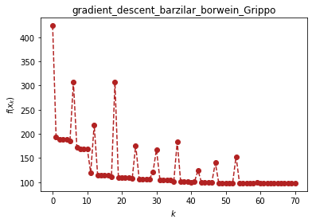
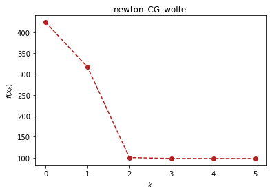
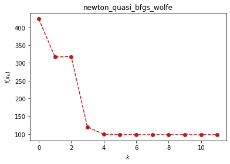
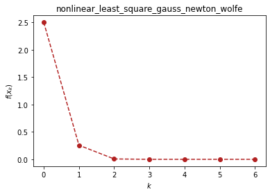
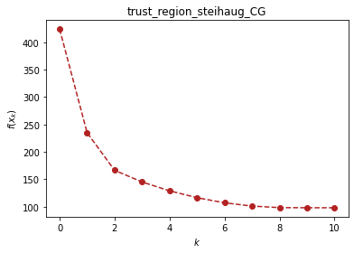

```python
import optimtool as oo
from optimtool.base import np, sp, plt
```

# 无约束优化（optimtool.unconstrain）
```python
import optimtool.unconstrain as ou
ou.[方法名].[函数名]([目标函数], [参数表], [初始迭代点])
```
$$
f(x)=\sum_{i=1}^{n/2}(-13+x_{2i-1}+((5-x_{2i})x_{2i}-2)x_{2i})^2+(-29+x_{2i-1}+((x_{2i}+1)x_{2i}-14)x_{2i})^2, x_0=[0.5, -2, 0.5, -2, ..., 0.5, -2].
$$


```python
import optimtool.unconstrain as ou
x = sp.symbols("x1:5")
f = (-13 + x[0] + ((5 - x[1])*x[1] - 2)*x[1])**2 + \
    (-29 + x[0] + ((x[1] + 1)*x[1] - 14)*x[1])**2 + \
    (-13 + x[2] + ((5 - x[3])*x[3] - 2)*x[3])**2 + \
    (-29 + x[2] + ((x[3] + 1)*x[3] - 14)*x[3])**2
x_0 = (1, -1, 1, -1) # Random given
```

## 梯度下降法（gradient_descent）

```python
ou.gradient_descent.[函数名]([目标函数], [参数表], [初始迭代点])
```

| 方法头                                                                                                                                 | 解释                                   |
| ----------------------------------------------------------------------------------------------------------------------------------- | ------------------------------------ |
| solve(funcs: FuncArray, args: ArgArray, x_0: PointArray, verbose: bool=False, draw: bool=True, output_f: bool=False, epsilon: float=1e-10, k: int=0) -> OutputType                                                             | 通过解方程的方式来求解精确步长                      |
| steepest(funcs: FuncArray, args: ArgArray, x_0: PointArray, verbose: bool=False, draw: bool=True, output_f: bool=False, method: str="wolfe", epsilon: float=1e-10, k: int=0) -> OutputType                                           | 使用线搜索方法求解非精确步长（默认使用wolfe线搜索）         |
| barzilar_borwein(funcs: FuncArray, args: ArgArray, x_0: PointArray, verbose: bool=False, draw: bool=True, output_f: bool=False, method: str="Grippo", c1: float=0.6, beta: float=0.6, M: int=20, eta: float=0.6, alpha: float=1., epsilon: float=1e-10, k: int=0) -> OutputType | 使用Grippo与ZhangHanger提出的非单调线搜索方法更新步长 |


```python
ou.gradient_descent.barzilar_borwein(f, x, x_0, verbose=True)
```

```text
(1, -1, 1, -1)	424.0	0
[ 1.0282111  -1.37928255  1.0282111  -1.37928255]	193.18208282562685	1
[ 1.04040867 -1.45642123  1.04040867 -1.45642123]	189.0040684546344	2
[ 1.04573189 -1.43382824  1.04573189 -1.43382824]	188.20259734914447	3
[ 1.05222391 -1.43478456  1.05222391 -1.43478456]	188.08207712135982	4
[ 1.21842112 -1.42548248  1.21842112 -1.42548248]	185.05873828867217	5
[ 2.13614312 -1.67393179  2.13614312 -1.67393179]	306.7394504286324	6
[ 2.13053183 -1.42904408  2.13053183 -1.42904408]	172.16897818349085	7
[ 2.13339147 -1.39448997  2.13339147 -1.39448997]	169.54142322335804	8
[ 2.13850418 -1.38626852  2.13850418 -1.38626852]	169.35850903892373	9
[ 2.14666499 -1.38571894  2.14666499 -1.38571894]	169.227056416181	10
[ 6.85105964 -1.21882377  6.85105964 -1.21882377]	119.64121168102085	11
[ 6.8498659  -0.82709031  6.8498659  -0.82709031]	219.03283073918098	12
[ 6.87286516 -1.13855733  6.87286516 -1.13855733]	114.81862255975581	13
[ 6.87787713 -1.15612617  6.87787713 -1.15612617]	114.57067950669307	14
[ 6.88112043 -1.1522921   6.88112043 -1.1522921 ]	114.53212856523825	15
[ 6.88723442 -1.15237179  6.88723442 -1.15237179]	114.4874731593348	16
[ 7.52073059 -1.08160888  7.52073059 -1.08160888]	111.60689603108094	17
[ 7.57812354 -1.50383598  7.57812354 -1.50383598]	306.84873605591366	18
[ 7.56259284 -1.10432895  7.56259284 -1.10432895]	110.06340620150246	19
[ 7.56525162 -1.11305159  7.56525162 -1.11305159]	109.911624361985	20
[ 7.56845044 -1.11585182  7.56845044 -1.11585182]	109.88443556709709	21
[ 7.57424656 -1.11514511  7.57424656 -1.11514511]	109.84842622986348	22
[ 8.11472065 -1.124156    8.11472065 -1.124156  ]	108.33148877567422	23
[ 8.11772403 -0.81394219  8.11772403 -0.81394219]	176.07597876873672	24
[ 8.13698116 -1.07860275  8.13698116 -1.07860275]	106.66200945891629	25
[ 8.14033875 -1.08558041  8.14033875 -1.08558041]	106.60960131271904	26
[ 8.14318086 -1.08408182  8.14318086 -1.08408182]	106.59292627568138	27
[ 8.15742491 -1.08445094  8.15742491 -1.08445094]	106.51940774009873	28
[ 8.48884737 -0.93560402  8.48884737 -0.93560402]	121.29547878113888	29
[ 8.51700355 -1.29748928  8.51700355 -1.29748928]	167.74917901005443	30
[ 8.50650818 -1.0447501   8.50650818 -1.0447501 ]	105.17130292526846	31
[ 8.50937365 -1.06118332  8.50937365 -1.06118332]	104.7825239343216	32
[ 8.51183986 -1.06396653  8.51183986 -1.06396653]	104.76340239835628	33
[ 8.51547867 -1.06364105  8.51547867 -1.06364105]	104.74639927086304	34
[ 9.69145476 -1.02322347  9.69145476 -1.02322347]	101.04132063991622	35
[ 9.69050332 -0.68561143  9.69050332 -0.68561143]	183.98629666416807	36
[ 9.71196065 -0.99177179  9.71196065 -0.99177179]	100.33437559015809	37
[ 9.71395331 -0.99691463  9.71395331 -0.99691463]	100.31205044592872	38
[ 9.71544113 -0.99582983  9.71544113 -0.99582983]	100.30702675123581	39
[ 9.72019742 -0.99588572  9.72019742 -0.99588572]	100.29410115962547	40
[ 9.96789324 -0.94002557  9.96789324 -0.94002557]	101.28390045346998	41
[ 9.98515667 -1.13463891  9.98515667 -1.13463891]	124.13069129617023	42
[ 9.97775526 -0.97677181  9.97775526 -0.97677181]	99.65833683277478	43
[ 9.97905436 -0.98038717  9.97905436 -0.98038717]	99.63998817758232	44
[ 9.98038184 -0.98072843  9.98038184 -0.98072843]	99.63682497083006	45
[ 9.99315753 -0.97962229  9.99315753 -0.97962229]	99.60739988195607	46
[10.72291903 -1.14038158 10.72291903 -1.14038158]	140.09339786064479	47
[10.71193259 -0.92569239 10.71193259 -0.92569239]	98.51338476293776	48
[10.71311599 -0.93659146 10.71311599 -0.93659146]	98.37085839829686	49
[10.71381956 -0.93806458 10.71381956 -0.93806458]	98.3680657249001	50
[10.71452791 -0.93800544 10.71452791 -0.93800544]	98.36725745304659	51
[11.12651334 -0.91557278 11.12651334 -0.91557278]	98.0388345985881	52
[11.14786066 -0.6544586  11.14786066 -0.6544586 ]	152.98071929318402	53
[11.1650964  -0.91655585 11.1650964  -0.91655585]	98.04252800378062	54
[11.16500654 -0.91067409 11.16500654 -0.91067409]	98.01952239829447	55
[11.16527568 -0.91147253 11.16527568 -0.91147253]	98.01882653662886	56
[11.16551336 -0.91145949 11.16551336 -0.91145949]	98.01873008878108	57
[11.40881542 -0.89699632 11.40881542 -0.89699632]	97.96852205445705	58
[11.41569897 -0.94570498 11.41569897 -0.94570498]	100.18347217648343	59
[11.41282871 -0.89647302 11.41282871 -0.89647302]	97.96860513443596	60
[11.41284758 -0.89679161 11.41284758 -0.89679161]	97.96850744492629	61
[11.41284808 -0.89680115 11.41284808 -0.89680115]	97.96850736241191	62
[11.41284802 -0.89680115 11.41284802 -0.89680115]	97.96850736240476	63
[11.41281318 -0.89680322 11.41281318 -0.89680322]	97.96850735944307	64
[11.41277898 -0.8968052  11.41277898 -0.8968052 ]	97.96850735848295	65
[11.4127827  -0.89686768 11.4127827  -0.89686768]	97.9685108985368	66
[11.41277899 -0.89680525 11.41277899 -0.89680525]	97.96850735848004	67
[11.41277899 -0.89680525 11.41277899 -0.89680525]	97.96850735848004	68
[11.41277899 -0.89680525 11.41277899 -0.89680525]	97.96850735848007	69
[11.41277899 -0.89680525 11.41277899 -0.89680525]	97.96850735848005	70
```

<p align="center">
    <a href=""> 
         
    </a>
</p>

```text
(array([11.41277899, -0.89680525, 11.41277899, -0.89680525]), 70)
```

## 牛顿法（newton）

```python
ou.newton.[函数名]([目标函数], [参数表], [初始迭代点])
```

| 方法头                                                                                             | 解释                                |
| ----------------------------------------------------------------------------------------------- | --------------------------------- |
| classic(funcs: FuncArray, args: ArgArray, x_0: PointArray, verbose: bool=False, draw: bool=True, output_f: bool=False, epsilon: float=1e-10, k: int=0) -> OutputType                        | 通过直接对目标函数二阶导矩阵（海瑟矩阵）进行求逆来获取下一步的步长 |
| modified(funcs: FuncArray, args: ArgArray, x_0: PointArray, verbose: bool=False, draw: bool=True, output_f: bool=False, method: str="wolfe", epsilon: float=1e-10, k: int=0) -> OutputType | 修正当前海瑟矩阵保证其正定性（目前只接入了一种修正方法）      |
| CG(funcs: FuncArray, args: ArgArray, x_0: PointArray, verbose: bool=False, draw: bool=True, output_f: bool=False, method: str="wolfe", eps: float=1e-3, epsilon: float=1e-6, k: int=0) -> OutputType              | 采用牛顿-共轭梯度法求解梯度（非精确牛顿法的一种）         |


```python
ou.newton.CG(f, x, x_0, verbose=True)
```

```text
(1, -1, 1, -1)	424.0	0
[-2.58333333 -1.41666667 -2.58333333 -1.41666667]	316.8589262366773	1
[11.66038408 -0.93093632 11.66038408 -0.93093632]	100.19046565464129	2
[11.37281532 -0.90000411 11.37281532 -0.90000411]	97.97044184270206	3
[11.41274925 -0.89680976 11.41274925 -0.89680976]	97.96850736600598	4
[11.41274911 -0.89680703 11.41274911 -0.89680703]	97.96850735921517	5
```

<p align="center">
    <a href=""> 
         
    </a>
</p>

```text
(array([11.41274911, -0.89680703, 11.41274911, -0.89680703]), 5)
```

## 拟牛顿法（newton_quasi）

```python
ou.newton_quasi.[函数名]([目标函数], [参数表], [初始迭代点])
```

| 方法头                                                                                          | 解释              |
| -------------------------------------------------------------------------------------------- | --------------- |
| bfgs(funcs: FuncArray, args: ArgArray, x_0: PointArray, verbose: bool=False, draw: bool=True, output_f: bool=False, method: str="wolfe", epsilon: float=1e-10, k: int=0) -> OutputType  | BFGS方法更新海瑟矩阵    |
| dfp(funcs: FuncArray, args: ArgArray, x_0: PointArray, verbose: bool=False, draw: bool=True, output_f: bool=False, method: str="wolfe", epsilon: float=1e-10, k: int=0) -> OutputType    | DFP方法更新海瑟矩阵     |
| L_BFGS(funcs: FuncArray, args: ArgArray, x_0: PointArray, verbose: bool=False, draw: bool=True, output_f: bool=False, method: str="wolfe", m: int=6, epsilon: float=1e-10, k: int=0) -> OutputType | 双循环方法更新BFGS海瑟矩阵 |


```python
ou.newton_quasi.bfgs(f, x, x_0, verbose=True)
```

```text
(1, -1, 1, -1)	424.0	0
[-2.58333333 -1.41666667 -2.58333333 -1.41666667]	316.8589262367117	1
[-2.62231901 -1.41870216 -2.62231901 -1.41870216]	317.7181414041512	2
[12.34827743 -0.99197941 12.34827743 -0.99197941]	119.69430049634522	3
[10.38506302 -0.97660204 10.38506302 -0.97660204]	99.1887590330026	4
[11.1167875  -0.91944354 11.1167875  -0.91944354]	98.06444704676363	5
[11.406523   -0.89765767 11.406523   -0.89765767]	97.96874850140205	6
[11.41263195 -0.89681977 11.41263195 -0.89681977]	97.96850740648262	7
[11.41277931 -0.89680524 11.41277936 -0.89680524]	97.96850735848028	8
[11.41277892 -0.89680527 11.4127794  -0.89680523]	97.96850735848014	9
[11.41277892 -0.89680527 11.41277941 -0.89680523]	97.96850735848014	10
[11.41277899 -0.89680525 11.41277899 -0.89680525]	97.96850735848003	11
```

<p align="center">
    <a href=""> 
         
    </a>
</p>

```text
(array([11.41277899, -0.89680525, 11.41277899, -0.89680525]), 11)
```

## 非线性最小二乘法（nonlinear_least_square）

```python
ou.nonlinear_least_square.[函数名]([目标函数], [参数表], [初始迭代点])
```

| 方法头                                                                                                                                                  | 解释                         |
| ---------------------------------------------------------------------------------------------------------------------------------------------------- | -------------------------- |
| gauss_newton(funcr: FuncArray, args: ArgArray, x_0: PointArray, verbose: bool=False,, draw: bool=True, output_f: bool=False, method: str="wolfe", epsilon: float=1e-10, k: int=0) -> OutputType                                                        | 高斯-牛顿提出的方法框架，包括OR分解等操作     |
| levenberg_marquardt(funcr: FuncArray, args: ArgArray, x_0: PointArray, verbose: bool=False, draw: bool=True, output_f: bool=False, lamk: float=1., eta: float=0.2, p1: float=0.4, p2: float=0.9, gamma1: float=0.7, gamma2: float=1.3, epsk: float=1e-6, epsilon: float=1e-10, k: int=0) -> OutputType | Levenberg Marquardt提出的方法框架 |


```python
r1, r2, x1, x2 = sp.symbols("r1 r2 x1 x2")
r1 = x1**3 - 2*x2**2 - 1
r2 = 2*x1 + x2 - 2
ou.nonlinear_least_square.gauss_newton((r1, r2), (x1, x2), (1, 1), verbose=True)
```

```text
(1, 1)	2.5	0
[0.81818182 0.36363636]	0.2568683776624116	1
[0.96394194 0.07211612]	0.006580566252158881	2
[0.99803991 0.00392018]	1.7401957457499415e-05	3
[9.99993633e-01 1.27332936e-05]	1.824077317348686e-10	4
[1.00000000e+00 1.35111426e-10]	2.053700029739614e-20	5
[1.00000000e+00 6.08502493e-21]	1.8513764194952984e-41	6
```

<p align="center">
    <a href=""> 
         
    </a>
</p>

```text
(array([1.00000000e+00, 6.08502493e-21]), 6)
```

## 信赖域方法（trust_region）

```python
ou.trust_region.[函数名]([目标函数], [参数表], [初始迭代点])
```

| 方法头                                                                                                                                        | 解释                  |
| ------------------------------------------------------------------------------------------------------------------------------------------------- | ------------------- |
| steihaug_CG(funcs: FuncArray, args: ArgArray, x_0: PointArray, verbose: bool=False, draw: bool=True, output_f: bool=False, r0: float=1., rmax: float=2., eta: float=0.2, p1: float=0.4, p2: float=0.6, gamma1: float=0.5, gamma2: float=1.5, epsk: float=1e-6, epsilon: float=1e-6, k: int=0) -> OutputType | 截断共轭梯度法在此方法中被用于搜索步长 |


```python
ou.trust_region.steihaug_CG(f, x, x_0, verbose=True)
```

```text
(1, -1, 1, -1)	424.0	0
[ 1.37436693 -1.59987449  1.37436693 -1.59987449]	234.85673849734079	1
[ 2.41674356 -1.40378533  2.41674356 -1.40378533]	166.3039476276758	2
[ 3.82788408 -1.31060572  3.82788408 -1.31060572]	145.04222337248802	3
[ 5.2400307  -1.23417328  5.2400307  -1.23417328]	128.87290397464753	4
[ 6.65278513 -1.16994762  6.65278513 -1.16994762]	116.28517783715984	5
[ 8.06468738 -1.08912665  8.06468738 -1.08912665]	107.0112703070541	6
[ 9.47634365 -1.00411738  9.47634365 -1.00411738]	101.03664220216237	7
[10.88855469 -0.92888453 10.88855469 -0.92888453]	98.19478501142473	8
[11.4157009  -0.89681743 11.4157009  -0.89681743]	97.96854545237576	9
[11.41277892 -0.89680526 11.41277892 -0.89680526]	97.96850735848007	10
```

<p align="center">
    <a href=""> 
         
    </a>
</p>

```text
(array([11.41277892, -0.89680526, 11.41277892, -0.89680526]), 10)
```