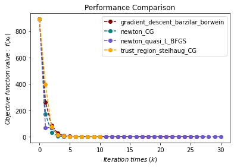
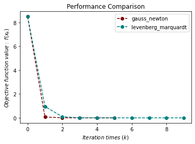
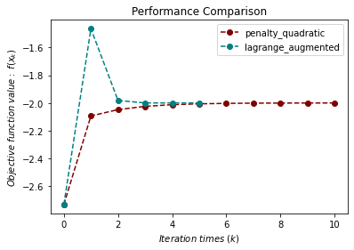
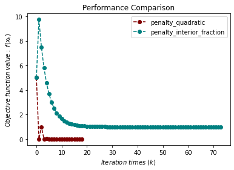
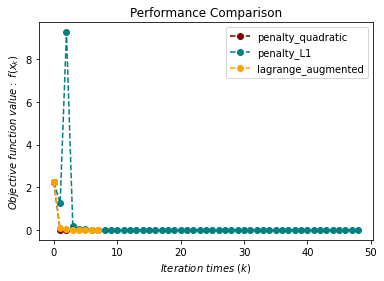
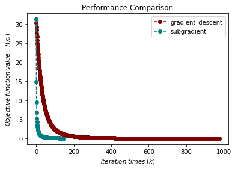
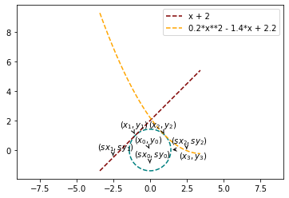

# 测试

## 无约束优化问题测试程序

```python
import sympy as sp
import matplotlib.pyplot as plt
import optimtool as oo

f, x1, x2, x3, x4 = sp.symbols("f x1 x2 x3 x4")
f = (x1 - 1)**2 + (x2 - 1)**2 + (x3 - 1)**2 + (x1**2 + x2**2 + x3**2 + x4**2 - 0.25)**2
funcs = f # [f] \ (f) \ sp.Matrix([f])
args = [x1, x2, x3, x4] # (x1, x2, x3, x4) \ sp.Matrix([args])
x_0 = (1, 2, 3, 4)

f_list = []
title = ["gradient_descent_barzilar_borwein", "newton_CG", "newton_quasi_L_BFGS", "trust_region_steihaug_CG"]
colorlist = ["maroon", "teal", "slateblue", "orange"]
_, _, f = oo.unconstrain.gradient_descent.barzilar_borwein(funcs, args, x_0, False, True)
f_list.append(f)
_, _, f = oo.unconstrain.newton.CG(funcs, args, x_0, False, True)
f_list.append(f)
_, _, f = oo.unconstrain.newton_quasi.L_BFGS(funcs, args, x_0, False, True)
f_list.append(f)
_, _, f = oo.unconstrain.trust_region.steihaug_CG(funcs, args, x_0, False, True)
f_list.append(f)

# draw
handle = []
for j, z in zip(colorlist, f_list):
    ln, = plt.plot([i for i in range(len(z))], z, c=j, marker='o', linestyle='dashed')
    handle.append(ln)
plt.xlabel("$Iteration \ times \ (k)$")
plt.ylabel("$Objective \ function \ value: \ f(x_k)$")
plt.legend(handle, title)
plt.title("Performance Comparison")
plt.show()
```

<div align="center">
    
</div>

## 非线性最小二乘问题测试程序

```python
import sympy as sp
import matplotlib.pyplot as plt
import optimtool as oo

r1, r2, x1, x2 = sp.symbols("r1 r2 x1 x2")
r1 = x1**3 - 2*x2**2 - 1
r2 = 2*x1 + x2 - 2
funcr = [r1, r2] # (r1, r2) \ sp.Matrix([funcr])
args = [x1, x2] # (x1, x2) \ sp.Matrix([args])
x_0 = (2, 2)

f_list = []
title = ["gauss_newton", "levenberg_marquardt"]
colorlist = ["maroon", "teal"]
_, _, f = oo.unconstrain.nonlinear_least_square.gauss_newton(funcr, args, x_0, False, True)
f_list.append(f)
_, _, f = oo.unconstrain.nonlinear_least_square.levenberg_marquardt(funcr, args, x_0, False, True)
f_list.append(f)

# draw
handle = []
for j, z in zip(colorlist, f_list):
    ln, = plt.plot([i for i in range(len(z))], z, c=j, marker='o', linestyle='dashed')
    handle.append(ln)
plt.xlabel("$Iteration \ times \ (k)$")
plt.ylabel("$Objective \ function \ value: \ f(x_k)$")
plt.legend(handle, title)
plt.title("Performance Comparison")
plt.show()
```

<div align="center">
    
</div>

## 等式约束优化问题测试程序

```python
import numpy as np
import sympy as sp
import matplotlib.pyplot as plt
import optimtool as oo

f, x1, x2 = sp.symbols("f x1 x2")
f = x1 + np.sqrt(3) * x2
c1 = x1**2 + x2**2 - 1
funcs = f # [f] \ (f) \ sp.Matrix([f])
cons = [c1] # c1 \ (c1) \ sp.Matrix([cons])
args = [x1, x2] # (x1, x2) \ sp.Matrix([args])
x_0 = (-1, -1)

f_list = []
title = ["penalty_quadratic", "lagrange_augmented"]
colorlist = ["maroon", "teal"]
_, _, f = oo.constrain.equal.penalty_quadratic(funcs, args, cons, x_0, False, True)
f_list.append(f)
_, _, f = oo.constrain.equal.lagrange_augmented(funcs, args, cons, x_0, False, True)
f_list.append(f)

# draw
handle = []
for j, z in zip(colorlist, f_list):
    ln, = plt.plot([i for i in range(len(z))], z, c=j, marker='o', linestyle='dashed')
    handle.append(ln)
plt.xlabel("$Iteration \ times \ (k)$")
plt.ylabel("$Objective \ function \ value: \ f(x_k)$")
plt.legend(handle, title)
plt.title("Performance Comparison")
plt.show()
```

<div align="center">
    
</div>

## 不等式约束优化问题测试程序

```python
import sympy as sp
import matplotlib.pyplot as plt
import optimtool as oo

f, x1, x2 = sp.symbols("f x1 x2")
f = x1**2 + (x2 - 2)**2
c1 = 1 - x1
c2 = 2 - x2
funcs = f # [f] \ (f) \ sp.Matrix([f])
cons = [c1, c2] # (c1, c2) \ sp.Matrix([cons])
args = [x1, x2] # (x1, x2) \ sp.Matrix([args])
x_0 = (2, 3)

f_list = []
title = ["penalty_quadratic", "penalty_interior_fraction"]
colorlist = ["maroon", "teal"]
_, _, f = oo.constrain.unequal.penalty_quadratic(funcs, args, cons, x_0, False, True, method="newton", sigma=10, epsilon=1e-6)
f_list.append(f)
_, _, f = oo.constrain.unequal.penalty_interior_fraction(funcs, args, cons, x_0, False, True, method="newton")
f_list.append(f)

# draw
handle = []
for j, z in zip(colorlist, f_list):
    ln, = plt.plot([i for i in range(len(z))], z, c=j, marker='o', linestyle='dashed')
    handle.append(ln)
plt.xlabel("$Iteration \ times \ (k)$")
plt.ylabel("$Objective \ function \ value: \ f(x_k)$")
plt.legend(handle, title)
plt.title("Performance Comparison")
plt.show()
```

<div align="center">
    
</div>

## 混合等式约束优化问题测试程序

```python
import sympy as sp
import matplotlib.pyplot as plt
import optimtool as oo

f, x1, x2 = sp.symbols("f x1 x2")
f = (x1 - 2)**2 + (x2 - 1)**2
c1 = x1 - 2*x2
c2 = 0.25*x1**2 - x2**2 - 1
funcs = f # [f] \ (f) \ sp.Matrix([f])
cons_equal = c1 # [c1] \ (c1) \ sp.Matrix([c1])
cons_unequal = c2 # [c2] \ (c2) \ sp.Matrix([c2])
args = [x1, x2] # (x1, x2) \ sp.Matrix([args])
x_0 = (0.5, 1)

f_list = []
title = ["penalty_quadratic", "penalty_L1", "lagrange_augmented"]
colorlist = ["maroon", "teal", "orange"]
_, _, f = oo.constrain.mixequal.penalty_quadratic(funcs, args, cons_equal, cons_unequal, x_0, False, True)
f_list.append(f)
_, _, f = oo.constrain.mixequal.penalty_L1(funcs, args, cons_equal, cons_unequal, x_0, False, True)
f_list.append(f)
_, _, f = oo.constrain.mixequal.lagrange_augmented(funcs, args, cons_equal, cons_unequal, x_0, False, True)
f_list.append(f)

# draw
handle = []
for j, z in zip(colorlist, f_list):
    ln, = plt.plot([i for i in range(len(z))], z, c=j, marker='o', linestyle='dashed')
    handle.append(ln)
plt.xlabel("$Iteration \ times \ (k)$")
plt.ylabel("$Objective \ function \ value: \ f(x_k)$")
plt.legend(handle, title)
plt.title("Performance Comparison")
plt.show()
```

<div align="center">
    
</div>

## Lasso问题测试程序

```python
import numpy as np
import sympy as sp
import matplotlib.pyplot as plt
import optimtool as oo

import scipy.sparse as ss
f, A, b, mu = sp.symbols("f A b mu")
x = sp.symbols('x1:9')
m = 4
n = 8
u = (ss.rand(n, 1, 0.1)).toarray()
A = np.random.randn(m, n)
b = A.dot(u)
mu = 1e-2
args = x # list(x) \ sp.Matrix(x)
x_0 = tuple([1 for i in range(8)])

f_list = []
title = ["gradient_descent", "subgradient"]
colorlist = ["maroon", "teal"]
_, _, f = oo.example.Lasso.gradient_descent(A, b, mu, args, x_0, False, True, epsilon=1e-4)
f_list.append(f)
_, _, f = oo.example.Lasso.subgradient(A, b, mu, args, x_0, False, True)
f_list.append(f)

# draw
handle = []
for j, z in zip(colorlist, f_list):
    ln, = plt.plot([i for i in range(len(z))], z, c=j, marker='o', linestyle='dashed')
    handle.append(ln)
plt.xlabel("$Iteration \ times \ (k)$")
plt.ylabel("$Objective \ function \ value: \ f(x_k)$")
plt.legend(handle, title)
plt.title("Performance Comparison")
plt.show()
```

<div align="center">
    
</div>

## 曲线切点问题测试程序

```python
# import packages
import sympy as sp
import matplotlib.pyplot as plt
import optimtool as oo

# make data
m = 1
n = 2
a = 0.2
b = -1.4
c = 2.2
x3 = 2*(1/2)
y3 = 0
x_0 = (0, -1, -2.5, -0.5, 2.5, -0.05)

# train
oo.example.WanYuan.gauss_newton(1, 2, 0.2, -1.4, 2.2, 2**(1/2), 0, (0, -1, -2.5, -0.5, 2.5, -0.05), draw=True)
```

<div align="center">
    
</div>