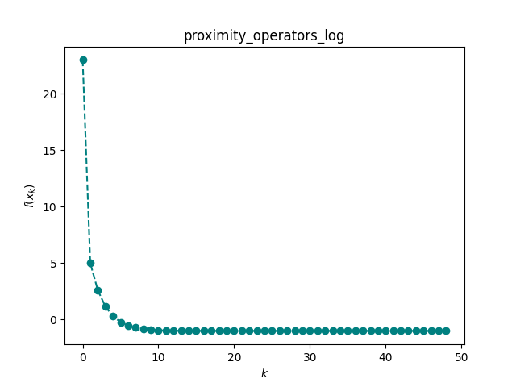
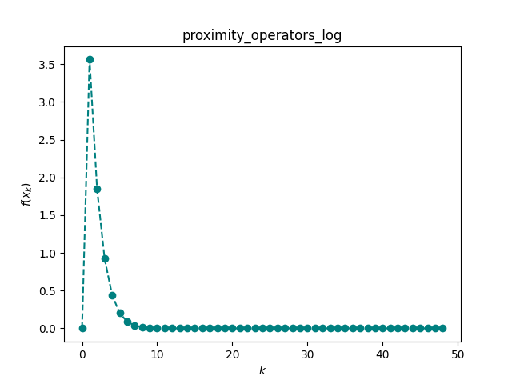
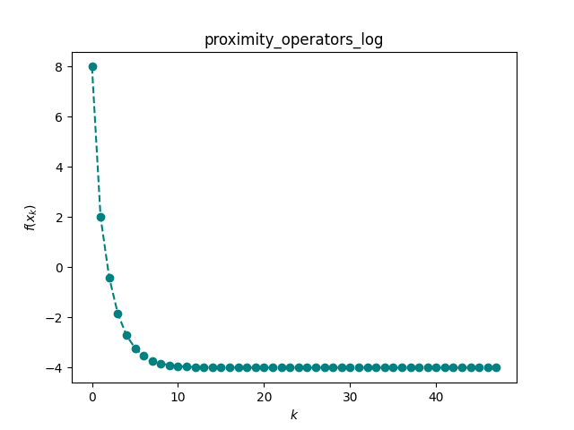

# 邻近算子-对数罚函数法

> 用于约束优化领域的一种基于邻近算子的内点罚函数法，解决采用无约束内核时迭代点溢出的问题（即迭代点超出**定义域**范围的问题）。

## 不等式约束优化

$$
\begin{aligned}
&\min f(x) \\
& \ s.t. c_i(x) \leq 0, i \in \mathcal{I}\\
\end{aligned}
$$

对于$f(x)$这个可微函数，我们需要在可行域内找到得到函数最小值的点。

## 罚函数法的区别

&emsp;&emsp;**外点罚函数法**，即在求解过程中允许自变量$x$位于原问题可行域之外，当罚因子趋于无穷时，子问题最优解序列从可行域外部逼近最优解。自然地，如果我们想要是得子问题最优解序列从可行域内部逼近最优解，则需要构造**内点罚函数法**。顾名思义，内点罚函数法在迭代时始终要求自变量$x$不能违反约束，因此它**主要**用于不等式约束优化问题。

&emsp;&emsp;考虑含不等式约束的优化问题，为了使得迭代点始终在可行域内，当迭代点趋于可行域边界时，我们需要罚函数法趋于正无穷。

&emsp;&emsp;然而在程序设计的过程中，由于内点罚函数法内置的无约束优化内核，会使得迭代点**溢出**可行域外，因此引入无约束优化内核会导致程序因为违反了对数罚函数的定义域规定而**终止**。

## 对数罚函数法

&emsp;&emsp;对不等式约束最优化问题，定义**对数罚函数**

$$
P_I(x, \sigma)=f(x)-\sigma \ln(-c_i(x))
$$

其中等式右端第二项称为惩罚项，$\sigma > 0$称为罚因子。

&emsp;&emsp;容易看到，$P_I(x,\sigma)$ 的定义域为 $\{x | c_i(x) < 0\}$，因此在迭代过程中自变量$x$严格位于可行域内部。当$x$趋于可行域边界时，由于对数罚函数的特点，$P_I(x,\sigma)$ 会趋于正无穷，这说明对数罚函数的极小值严格位于可行域内部．然而，对原问题，它的最优解通常位于可行域边界，即$c_i(x) \leq 0$中至少有一个取到等号，此时我们需要调整罚因子$\sigma$使其趋于 0，这会减弱对数罚函数在边界附近的惩罚效果．

`对数罚函数法`：

> 给定$\sigma_0>0$，可行解$x^0$，$k \leftarrow 0$，罚因子缩小系数$\rho \in (0,1)$.
> 
> **while**未达到收敛准则**do**
> 
> &emsp;以$x^k$为初始点，求解$x^{k+1}=\arg\min_x P_I(x, \sigma_k)$.
> 
> &emsp;选取$\sigma_{k+1}=\rho \sigma_k$.
> 
> &emsp;$k \leftarrow k + 1$
> 
> **end while**

## 邻近算子

邻近算子是处理非光滑问题的一个非常有效的工具。

`定义`（邻近算子）对于一个凸函数h，定义它的邻近算子为

$$
prox_h(x)={\arg \min}_{u \in dom h} \{h(u)+\dfrac{1}{2}||u-x||^2\}
$$

`定理1`（邻近算子是良定义的）如果h是适当的闭凸函数，则对任意的x \in R^n，prox_h(x)的值存在且唯一。

`定理2`（邻近算子与次梯度的关系）如果h是适当的闭凸函数，则：

$$
u=prox_h(x) \iff x-u \in ∂h(u)
$$

邻近算子的计算可以看成是次梯度算法的隐式格式（后向迭代），这实际是近似点算法的迭代格式

负自然对数的和：

$$
h(x)=-\sum_{i=1}^{n} \ln x_i, \ prox_{th}(x)_i=\dfrac{x_i+\sqrt{x_i^2+4t}}{2}, i=1,2,...,n
$$

## 近似点梯度法

内置的按索引寻找$P_I(x, \sigma_k)$函数极小值的内核，采用如下方式构建：

> **输入**：函数$f(x)$，$h(x)$，初始点$x^0$，初始化$k=0$.
> 
> **while**未达到收敛准则**do**
> 
> &emsp;$x^{k+1}=prox_{t_kh}(x^k-t^k\nabla f(x^k))$
> 
> &emsp;$k \leftarrow k + 1$.
> 
> **end while**

根据邻近算子的定义，把迭代公式展开：

$$
\begin{aligned}
x^{k+1}&=\arg\min_u\{h(u)+\dfrac{1}{2t_k}||u-x^k+t_k\nabla f(x^k)||^2\} \\
&= \arg\min_u\{h(u)+f(x^k)+\nabla f(x^k)^T(u-x^k)+\dfrac{1}{2t_k}||u-x^k||^2\}
\end{aligned}
$$

可以发现，近似点梯度法实质上就是将问题的光滑部分线性展开再加上二
次项并保留非光滑部分，然后求极小来作为每一步的估计。此外，根据`定理2`，近似点梯度算法可以形式上写成

$$
x^{k+1}=x^k-t_k \nabla f(x^k) - t_k g^k, g^k \in ∂h(x^{k+1})
$$

其本质上是对光滑部分做显示的梯度下降，关于非光滑部分做隐式的梯度下降。

&emsp;&emsp;步长$t_k$的选取较为关键。当$f$为梯度$L$-利普希茨连续函数时，可取固定步长$t_k=t \leq \frac{1}{L}$。当$L$未知时，可使用**线搜索准则**

$$
f(x^{k+1}) \leq f(x^k)+\nabla f(x^k)^T(x^{k+1}-x^k)+\dfrac{1}{2t_k} ||x^{k+1}-x^k||^2
$$

## 约束优化在邻近算子中的讨论

令$h(y)=-\sum_{i=1}^{n} \ln y_i$，则有：

$$
proy_{th}(y)_i=\dfrac{y_i+\sqrt{y_i^2+4t}}{2}, i=1,2,...,n
$$

令$y_i = -c_i(x)$，则有：

$$
\begin{aligned}
y_1 &= -c_1(x) \\
y_2 &= -c_2(x) \\
... \\
y_k &= -c_k(x) \\ 
\end{aligned}
$$

可以得到$x_i$关于$y$的**等式**。

$$
y=Ax, y=(y_1, y_2, ..., y_k)^T, x=(x_1, x_2, ...,x_k)^T
$$

其中$A$为系数矩阵，当$A$可逆时，**显示解**存在。

> 若$A$不可逆，通过分析推导，将$c_i(x) \leq 0$的可行域作出一定调整，但是仍然包含目标问题的最优点。

将上述等式代入$f(x)$可以得到$l(y)$的方程。此时有：

$$
f(x)-\sigma \sum_{i=1}^{n} \ln (-c_i(x)) \equiv l(y) -\sigma \sum_{i=1}^{n} \ln (y)
$$

`对数罚函数法`：

> 给定$\sigma_0>0$，可行解$x^0$，$k \leftarrow 0$，罚因子缩小系数$\rho \in (0,1)$.
> 
> 由$y_i(x)=-c_i(x)$得到$y_{0i}$
> 
> **while**未达到收敛准则**do**
> 
> &emsp;以$y^k$为初始点，求解$y^{k+1}=\arg\min_y P_I(y, \sigma_k)$.
> 
> &emsp;选取$\sigma_{k+1}=\rho \sigma_k$.
> 
> &emsp;$k \leftarrow k + 1$
> 
> 由$y_i(x)=-c_i(x)$得到$x_k$
> 
> **end while**

$P_I(y, \sigma_k$：

> **输入**：函数$l(y)$，$h(y)$，初始点$y^0$，初始化$k=0$.
> 
> **while**未达到收敛准则**do**
> 
> &emsp;$y^{k+1}=proy_{t_kh}(y^k-t^k\nabla f(y^k))$
> 
> &emsp;$k \leftarrow k + 1$.
> 
> **end while**

## 算法设计

以下设计$l(y)-\sigma \sum_{i=1}^{n} \ln y_i$的算法程序：

```python
import sympy as sp
import numpy as np
import matplotlib.pyplot as plt
# 绘图函数
def plot_iteration(f, draw, method):
    '''
    Parameters
    ----------
    f : list
        迭代函数值列表

    draw : bool
        绘图参数

    method : string
        最优化方法


    Returns
    -------
    None

    '''
    if draw is True:
        plt.plot([i for i in range(len(f))], f, marker='o', c="teal", ls='--')
        plt.xlabel("$k$")
        plt.ylabel("$f(x_k)$")
        plt.title(method)
        plt.show()
    return None

# 取值
def f_x_k(funcs, args, x_0):
    '''
    Parameters
    ----------
    funcs : sympy.matrices.dense.MutableDenseMatrix
        当前目标方程

    args : sympy.matrices.dense.MutableDenseMatrix
        参数列表

    x_0 : list or tuple
        初始迭代点列表（或元组）


    Returns
    -------
    float
        迭代函数值

    '''
    funcsv = np.array(funcs.subs(dict(zip(args, x_0)))).astype(np.float64)
    return funcsv[0][0]

# 数据转换
def data_convert(funcs, args):
    '''
    Parameters
    ----------
    funcs : list or tuple or single value
        目标函数

    args : list or tuple or single value 
        参数


    Returns
    -------
    funcs : sympy.matrices.dense.MutableDenseMatrix
        目标函数

    args : sympy.matrices.dense.MutableDenseMatrix 
        参数

    '''
    # convert funcs
    if funcs is not None:
        if isinstance(funcs, (list, tuple)):
            funcs = sp.Matrix(funcs)
        else:
            funcs = sp.Matrix([funcs])

    # convert args
    if args is not None:
        if isinstance(args, (list, tuple)):
            args = sp.Matrix(args)
        else:
            args = sp.Matrix([args])
    return funcs, args

# P_I(y, \sigma_k)
def neg_log(funcs, sigma, args, x_0, tk=0.02, epsilon=1e-10, k=0):
    '''
    Parameters
    ----------
    funcs : sympy.matrices.dense.MutableDenseMatrix
        当前目标方程

    sigma : float
        罚项系数

    args : sympy.matrices.dense.MutableDenseMatrix
        参数列表

    x_0 : list
        初始迭代点列表

    tk : float
        固定步长

    epsilon : double
        迭代停机准则

    k : int
        迭代次数


    Returns
    -------
    tuple
        最终收敛点, 迭代次数

    '''
    assert tk > 0
    funcs, args = data_convert(funcs, args)
    res = funcs.jacobian(args)
    point = []
    while 1:
        reps = dict(zip(args, x_0))
        point.append(x_0)
        grad = np.array(res.subs(reps)).astype(np.float64)
        x_0 = ((x_0 - tk * grad[0]) + np.sqrt((x_0 - tk * grad[0])**2 + 4 * tk * sigma)) / 2
        k = k + 1
        if np.linalg.norm(x_0 - point[k - 1]) < epsilon:
            point.append(x_0)
            break
    return x_0, k

# 求解主函数
def solve(funcs, args, x_0, draw=True, sigma=6, p=0.6, epsilon=1e-10, k=0):
    '''
    Parameters
    ----------
    funcs : sympy.matrices.dense.MutableDenseMatrix
        当前目标方程

    args : sympy.matrices.dense.MutableDenseMatrix
        参数列表

    x_0 : list
        初始迭代点列表

    draw : bool
        绘图接口参数

    output_f : bool
        输出迭代函数值列表

    sigma : double
        罚函数因子

    p : double
        修正参数

    epsilon : double
        迭代停机准则

    k : int
        迭代次数


    Returns
    -------
    tuple
        最终收敛点, 迭代次数, (迭代函数值列表)

    '''
    assert sigma > 0
    assert p > 0
    assert p < 1
    funcs, args = data_convert(funcs, args)
    point = []
    f = []
    while 1:
        point.append(np.array(x_0))
        f.append(f_x_k(funcs, args, x_0))
        x_0, _ = neg_log(funcs, sigma, args, tuple(x_0))
        k = k + 1
        sigma = p * sigma
        if np.linalg.norm(x_0 - point[k - 1]) < epsilon:
            point.append(np.array(x_0))
            f.append(f_x_k(funcs, args, x_0))
            break
    plot_iteration(f, draw, "proximity_operators_log")
    return x_0, k
```

## 应用举例

### 1. 示例1

考虑优化问题

$$
\begin{aligned}
&\min x^2+2xy+y^2+2x-2y, \\
& \ s.t. -x \leq 0, -y \leq 0\\
\end{aligned}
$$

为了方便表示，我们令$x=x_1$，$y=x_2$，有:

$$
\begin{aligned}
&\min x_1^2+2x_1x_2+x_2^2+2x_1-2x_2, \\
& \ s.t. -x_1 \leq 0, -x_2 \leq 0\\
\end{aligned}
$$

令$y_1 = -(-x_1)$，$y_2=-(-x_2)$，我们有：

$$
y_1 = x_1, y_2=x_2
$$

即有方程：

$$
\begin{aligned}
&\min y_1^2+2y_1y_2+y_2^2+2y_1-2y_2, \\
& \ s.t. y_1 \geq 0, y_2 \geq 0\\
\end{aligned}
$$

```python
x1, x2 = sp.symbols("x1 x2")
f = x1**2 + 2*x1*x2 + x2**2 + 2*x1 - 2*x2
print(solve(f, [x1, x2], (2, 3)))
```

`结果`：

```textile
(array([5.61306487e-11, 1.00000000e+00]), 48)
```

也就是`(0, 1)`

`可视化`



### 2. 示例2

$$
\begin{aligned}
&f(x) = x_1^2 + (x_2-2)^2 \\
& s.t. \ x_1 - 1\leq 0, \ 1 - x_2 \leq 0
\end{aligned}
$$

根据上述的转换有，$y_1 = 1-x_1$，$y_2=x_2-1$，于是有：

$$
\begin{aligned}
&l(y) = (1 - y_1)^2 + (y_2 - 1)^2 \\
& s.t. \ y_1 \geq 0, \ y_2 \geq 0
\end{aligned}
$$

给定初始点$x_0=(-1, 2)$，那么$y_0=(2, 1)$。

```python
x1, x2 = sp.symbols("x1 x2")
f = (x2-1)**2 + (-x1+1)**2
print(solve(f, [x1, x2], (2, 1)))
```

`结果`：

```textile
(array([1., 1.]), 48) # y_0
```

换算坐标可以得到：

```textile
(array([0., 2.]), 48) # x_0
```

`可视化`：

<div align="center">
    
</div>

### 3. 示例3

$$
\begin{aligned}
&f(x) = x_1^2 + x_2^2 \\
& s.t. \ x_1 + x_2 - 2 \leq 0, \ x_2 - 1\leq 0
\end{aligned}
$$

通过推导变形有，令$y_1=-x_1-x_2+2, y_2=1-x_2$，有：

$$
\begin{aligned}
&f(x) = (1-y_1+y_2)^2 + (1-y_2)^2 \\
& s.t. \ y_1 \geq 0, \ y_2\geq 0
\end{aligned}
$$

给定初始点$x_0=(0,0)$，那么$y_0=(2,1)$。

```python
x1, x2 = sp.symbols("x1 x2")
f = (1-x1+x2)**2 + (1-x2)**2
print(solve(f, [x1, x2], (2, 1)))
```

`结果`:

```text
(array([2, 1]), 48)
```

按坐标换算之后：

```textile
(array([0, 0]), 48)
```

`可视化`：



### 4. 示例4

$$
\begin{aligned}
&\min x_1^2+2x_1x_2+x_1^2+2x_1-2x_2, \\
& \ s.t. \ x_1^2 - 1 \leq 0, x_2^3 - 1 \leq 0, x_1 + x_2 - 2 \leq 0\\
\end{aligned}
$$

上述的约束方程太过繁琐，我们可以尝试放大可行域，依次达到**降维**的目的，于是有：

$$
\begin{aligned}
&\min x_1^2+2x_1x_2+x_1^2+2x_1-2x_2, \\
& \ s.t. \ x_1 - 1 \leq 0, x_2 - 1 \leq 0\\
\end{aligned}
$$

显然$x_1$从$[-1, 1]$被放大到$(-\infty, 1]$，因为$x_2^2 +x_2+1>0$，所以等价于$x_2 - 1$，然后第二项可以忽略，于是得到了更新后的式子。

令$y_1=1-x_1$，$y_2=1-x_2$，得到：

$$
\begin{aligned}
&\min \ (1 - y_1)^2+2(1-y_1)(1-y_2)+(1-y_1)^2+2(1-y_1)-2(1-y_2), \\
& \ s.t. \ y_1 \geq 0, y_2 \geq 0\\
\end{aligned}
$$

设初始点$x_0=(-1, -2)$，则$y_0=(2, 3)$

```python
x1, x2 = sp.symbols("x1 x2")
f = (1 - x1)**2 + 2*(1-x1)*(1-x2) + (1-x1)**2 + 2*(1-x1)-2*(1-x2)
print(solve(f, [x1, x2], (2, 3)))
```

`结果`:

```textile
(array([2, 0]), 47)
```

`按坐标换算后有`:

```textile
(array([0, 1]), 47)
```

`可视化`:



## 大致思想

将原不等式约束方程的可行域适当放大与变形，尽量与$y=Ax$对齐，变量个数保持一致。随后可调用`邻近算子-对数罚函数法`进行训练学习。