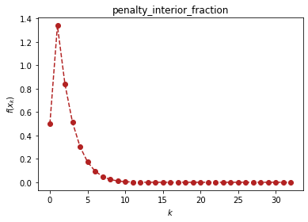

```python
# load important dependencies
import numpy as np
import sympy as sp
import matplotlib.pyplot as plt
```

# 约束优化算法（optimtool.constrain）

```python
import optimtool.constrain as oc
oc.[方法名].[函数名]([目标函数], [参数表], [等式约束表], [不等式约数表], [初始迭代点])
```


```python
import optimtool.constrain as oc
f, x1, x2 = sp.symbols("f x1 x2")
f = (x1 - 2)**2 + (x2 - 1)**2
c1 = x1 - x2 - 1
c2 = 0.25*x1**2 - x2 - 1
```

## 等式约束（equal）

```python
oc.equal.[函数名]([目标函数], [参数表], [等式约束表], [初始迭代点])
```

| 方法头                                                                                                                                                   | 解释        |
| ----------------------------------------------------------------------------------------------------------------------------------------------------- | --------- |
| penalty_quadratice(funcs: FuncArray, args: FuncArray, cons: FuncArray, x_0: PointArray, draw: Optional[bool]=True, output_f: Optional[bool]=False, method: Optional[str]="gradient_descent", sigma: Optional[float]=10, p: Optional[float]=2, epsilon: Optional[float]=1e-4, k: Optional[int]=0) -> OutputType                     | 增加二次罚项    |
| lagrange_augmentede(funcs: FuncArray, args: ArgArray, cons: FuncArray, x_0: PointArray, draw: Optional[bool]=True, output_f: Optional[bool]=False, method: Optional[str]="gradient_descent", lamk: Optional[float]=6, sigma: Optional[float]=10, p: Optional[float]=2, etak: Optional[float]=1e-4, epsilon: Optional[float]=1e-6, k: Optional[int]=0) -> OutputType | 增广拉格朗日乘子法 |


```python
oc.equal.lagrange_augmentede(f, (x1, x2), c1, (1, 0.5))
```


<p align="center">
    <a href=""> 
         
    </a>
</p>


    (array([1.99999998, 1.00000002]), 5)


## 不等式约束（unequal）

```python
oc.unequal.[函数名]([目标函数], [参数表], [不等式约束表], [初始迭代点])
```

| 方法头                                                                                                                                                                      | 解释        |
| ------------------------------------------------------------------------------------------------------------------------------------------------------------------------ | --------- |
| penalty_quadraticu(funcs: FuncArray, args: ArgArray, cons: FuncArray, x_0: PointArray, draw: Optional[bool]=True, output_f: Optional[bool]=False, method: Optional[str]="gradient_descent", sigma: Optional[float]=10, p: Optional[float]=0.4, epsilon: Optional[float]=1e-10, k: Optional[int]=0) -> OutputType                                     | 增加二次罚项    |
| penalty_interior_fraction(funcs: FuncArray, args: ArgArray, cons: FuncArray, x_0: PointArray, draw: Optional[bool]=True, output_f: Optional[bool]=False, method: Optional[str]="gradient_descent", sigma: Optional[float]=12, p: Optional[float]=0.6, epsilon: Optional[float]=1e-6, k: Optional[int]=0) -> OutputType                              | 增加分式函数罚项  |
| lagrange_augmentedu(funcs: FuncArray, args: ArgArray, cons: FuncArray, x_0: PointArray, draw: Optional[bool]=True, output_f: Optional[bool]=False, method: Optional[str]="gradient_descent", muk: Optional[float]=10, sigma: Optional[float]=8, alpha: Optional[float]=0.2, beta: Optional[float]=0.7, p: Optional[float]=2, eta: Optional[float]=1e-1, epsilon: Optional[float]=1e-4, k: Optional[int]=0) -> OutputType | 增广拉格朗日乘子法 |


```python
oc.unequal.penalty_interior_fraction(f, (x1, x2), c2, (1.5, 0.5))
```


<p align="center">
    <a href=""> 
         
    </a>
</p>


    (array([1.9999992, 1.0000008]), 32)


## 混合等式约束（mixequal）

```python
oc.mixequal.[函数名]([目标函数], [参数表], [等式约束表], [不等式约束表], [初始迭代点])
```

| 方法头                                                                                                                                                                                                  | 解释        |
| ---------------------------------------------------------------------------------------------------------------------------------------------------------------------------------------------------- | --------- |
| penalty_quadraticm(funcs: FuncArray, args: ArgArray, cons_equal: FuncArray, cons_unequal: FuncArray, x_0: PointArray, draw: Optional[bool]=True, output_f: Optional[bool]=False, method: Optional[str]="gradient_descent", sigma: Optional[float]=10, p: Optional[float]=0.6, epsilon: Optional[float]=1e-10, k: Optional[int]=0) -> OutputType                                             | 增加二次罚项    |
| penalty_L1(funcs: FuncArray, args: ArgArray, cons_equal: FuncArray, cons_unequal: FuncArray, x_0: PointArray, draw: Optional[bool]=True, output_f: Optional[bool]=False, method: Optional[str]="gradient_descent", sigma: Optional[float]=1, p: Optional[float]=0.6, epsilon: Optional[float]=1e-10, k: Optional[int]=0) -> OutputType                                                     | L1精确罚函数法  |
| lagrange_augmentedm(funcs: FuncArray, args: ArgArray, cons_equal: FuncArray, cons_unequal: FuncArray, x_0: PointArray, draw: Optional[bool]=True, output_f: Optional[bool]=False, method: Optional[str]="gradient_descent", lamk: Optional[float]=6, muk: Optional[float]=10, sigma: Optional[float]=8, alpha: Optional[float]=0.5, beta: Optional[float]=0.7, p: Optional[float]=2, eta: Optional[float]=1e-3, epsilon: Optional[float]=1e-4, k: Optional[int]=0) -> OutputType | 增广拉格朗日乘子法 |


```python
oc.mixequal.penalty_L1(f, (x1, x2), c1, c2, (1.5, 0.5))
```


<p align="center">
    <a href=""> 
         
    </a>
</p>


    (array([2., 1.]), 47)


```python

```
