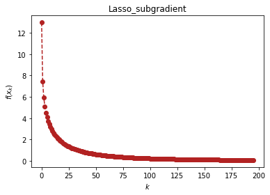
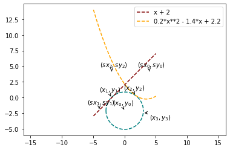

```python
# load important dependencies
import numpy as np
import sympy as sp
import matplotlib.pyplot as plt
```

# 方法的应用（optimtool.example）


```python
import optimtool.example as oe
```

## Lasso问题（Lasso）

```python
oe.Lasso.[函数名]([矩阵A], [矩阵b], [因子mu], [参数表], [初始迭代点])
```

| 方法头                                                                                                     | 解释               |
| ------------------------------------------------------------------------------------------------------- | ---------------- |
| gradient(A: NDArray, b: NDArray, mu: float, args: ArgArray, x_0: PointArray, draw: Optional[bool]=True, output_f: Optional[bool]=False, delta: Optional[float]=10, alp: Optional[float]=1e-3, epsilon: Optional[float]=1e-2, k: Optional[int]=0) -> OutputType | 光滑化Lasso函数法      |
| subgradient(A: NDArray, b: NDArray, mu: float, args: ArgArray, x_0: PointArray, draw: Optional[bool]=True, output_f: Optional[bool]=False, alphak: Optional[float]=2e-2, epsilon: Optional[float]=1e-3, k: Optional[int]=0) -> OutputType             | 次梯度法Lasso避免一阶不可导 |
| penalty(A: NDArray, b: NDArray, mu: float, args: ArgArray, x_0: PointArray, draw: Optional[bool]=True, output_f: Optional[bool]=False, gamma: Optional[float]=0.01, epsilon: Optional[float]=1e-6, k: Optional[int]=0) -> OutputType | 罚函数法 |
| approximate_point(A: NDArray, b: NDArray, mu: float, args: ArgArray, x_0: PointArray, draw: Optional[bool]=True, output_f: Optional[bool]=False, epsilon: Optional[float]=1e-4, k: Optional[int]=0) -> OutputType | 邻近算子更新 |


```python
import scipy.sparse as ss
x = sp.symbols('x1:9')
m, n = 4, 8
u = (ss.rand(n, 1, 0.1)).toarray()
Mu = 1e-3
A = np.random.randn(m, n)
b = np.random.randn(m, n).dot(u)
x_0 = tuple([1 for i in range(8)])
oe.Lasso.subgradient(A, b, Mu, x, x_0)
```


<p align="center">
    <a href=""> 
         
    </a>
</p>


    (array([ 0.07456688,  0.36298182,  0.60235168,  0.95056623,  0.5478307 ,
            -0.17265006,  1.24663594,  1.06914889]),
     195)


## 曲线相切问题（WanYuan）

```python
oe.WanYuan.[函数名]([直线的斜率], [直线的截距], [二次项系数], [一次项系数], [常数项], [圆心横坐标], [圆心纵坐标], [初始迭代点])
```

问题描述：

```text
给定直线的斜率和截距，给定一个抛物线函数的二次项系数，一次项系数与常数项。 要求解一个给定圆心的圆，该圆同时与抛物线、直线相切，若存在可行方案，请给出切点的坐标。
```

| 方法头                                                             | 解释                   |
| --------------------------------------------------------------- | -------------------- |
| solution(m: float, n: float, a: float, b: float, c: float, x3: float, y3: float, x_0: tuple, draw: Optional[bool]=False, eps: Optional[float]=1e-10) -> None | 使用高斯-牛顿方法求解构造的7个残差函数 |


```python
oe.WanYuan.solution(1, 2, 0.2, -1.4, 2.2, 3, -2.5, (4, 4, -4, -2, -2, 4), True)
```

    (x0, y0)= (0.04, -2.11) 
    (x1, y1)= (-2.07, -0.0) 
    (x2, y2)= (1.75, 0.34)
    


<p align="center">
    <a href=""> 
         
    </a>
</p>


```python

```
